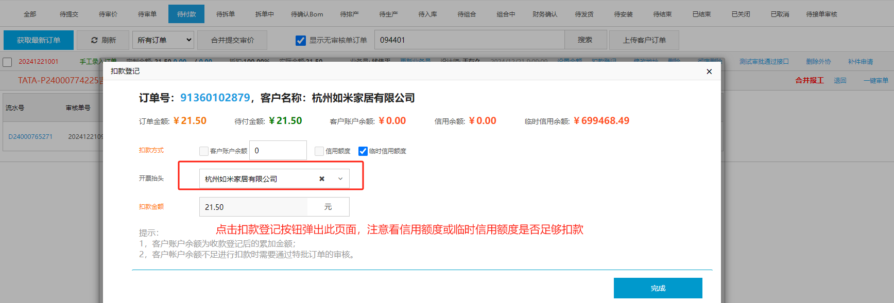
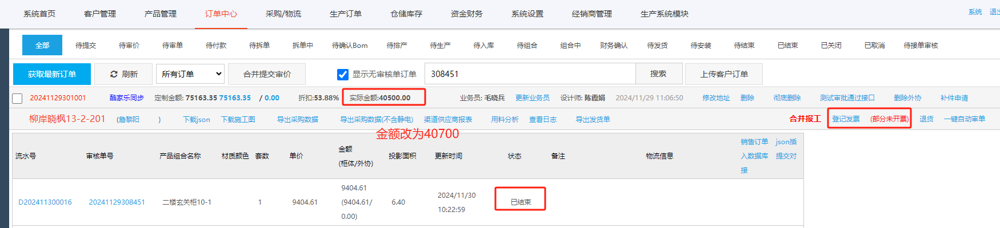

<div style="display:flex;">
</img><h1>销售订单改价和客户抬头问题</h1>
</div>

::: info 提出问题:

<u>&nbsp;&nbsp;&nbsp;&nbsp;&nbsp;&nbsp;由于一系列客观原因，某个销售定制订单需要修改销售总价或客户抬头的问题？</u>
:::

## 解决方法

::: tip 温馨提示:
&nbsp;&nbsp;&nbsp;&nbsp;&nbsp;&nbsp;首先需要根据订单 ID 找到我们要操作的是那个单子，然后再观察一下单子的状态以及其他情况，比如是否已经出库，是否已经开票。销售订单状态是否是状态码 7 和销售订单明细的状态是什么，比如是【待确认 bom】，【待发货】，【代付款】等状态，这两项条件决定了我们后续应该如何操作此单据,修改状态码为 7 是为了使客户的资金回退和抵扣!
:::

```ts
select * from dake.salesorder a where a.SalesOrderNo='91360098369';

```


### 条件一：仅修改客户抬头，销售总价不变

::: tip 步骤 1:
&nbsp;&nbsp;&nbsp;&nbsp;&nbsp;&nbsp;假设此时的单据明细状态是【待确认 bom】，销售订单状态默认是 status：7，可直接在系统中找到对应的单据，点击重拆按钮，退回单据。
:::


::: tip 步骤 2：
待单据退回到【待付款】状态时，首先查看一下旧客户的资金是否回退成功，然后点击【待付款】选项，就可以修改客户抬头了
:::


::: tip 步骤 3：
&nbsp;&nbsp;&nbsp;&nbsp;&nbsp;&nbsp;修改客户抬头，修改完成后，重新对新客户发起扣款，再查询新客户的资金明细即可
:::



---

### 条件二：仅修改销售总价，客户抬头不变

::: tip 步骤 1:
&nbsp;&nbsp;&nbsp;&nbsp;&nbsp;&nbsp;根据业务员提供的销售定制订单信息，可以得知此时单据还属于【已结束】状态中，说明客户已经完成了扣款，此时我们需要更新扣款的金额。
:::



---

::: tip 步骤 2：
&nbsp;&nbsp;&nbsp;&nbsp;&nbsp;&nbsp;将订单明细的状态改为【待发货】，系统提供了最后再重新修改一次金额的机会，此操作会回退之前已经扣款的金额，重新再划扣新添加的金额，具体明细可在客户的资金明细中查看，如下图所示：
:::


> 返回的资金再重新扣款：


::: tip 步骤 3：
由于此销售定制订单已经通知出库了，所以还需要根据下面的步骤修改出库单单据信息。如图所示：
:::


```ts
select * from dake.productoutstore a where a.ProductOutStoreNo='C26435879';
select * from dake.productoutstoredetail a where a.ProductOutStoreId=2842138;

```
