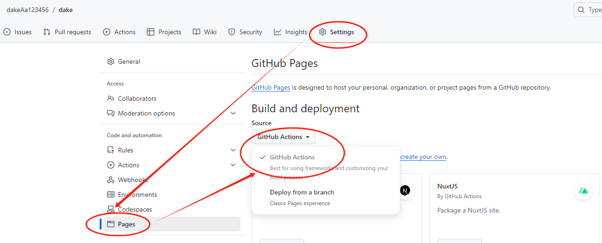
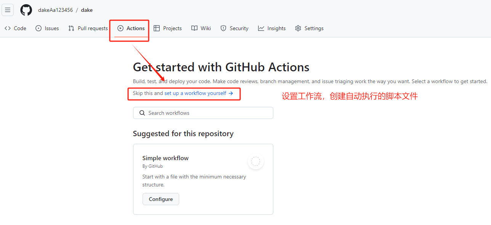
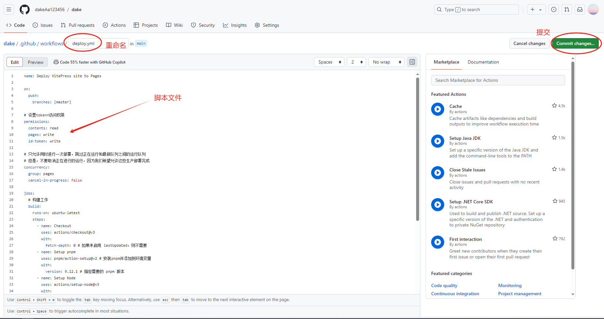
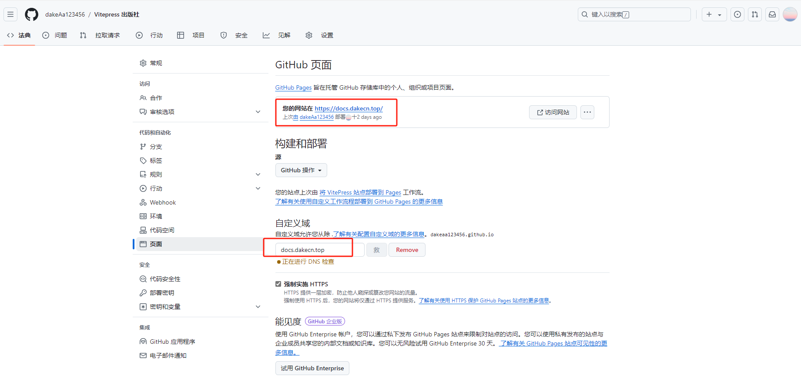

::: tip 部署指南
通过对vitepress搭建流程的学习，我们已经成功搭建了一个简单的文档网站，但是目前只能在本地访问，无法通过网络分享给其他人访问
本次将学习如何将本地网站部署到github上，供大家一起交流学习，如有遗漏之处，欢迎指正！
:::

## ***_快速上手_***
---

1. 点击链接[github](https://github.com/)进入官网，根据指引注册github账号，账号完成后根据下图所示新建仓库：


- 使用如下命令将本地项目传入git远程仓库。
- 在项目根目录打开Git Bash命令行窗口，初始化本地项目
```js
git init
```
- 暂存所有待提交到远程仓库的文件命令
```js
git add .
```
- 提交命令
```js
git commit -m "Initial commit" 
```
- 关联远程仓库
```js
git remote add origin https://github.com/dakeAa123456/vitepress.git
```
- 改变主分支名称,原分支名称是master
```js
git branch -M main
```
- 推送本地项目到远程仓库
```js
git push -u origin main
```
2. 选择Settings => Pages => GitHub Actions

3. 设置工作流

4. 重新命名并设置deploy脚本，注意查看脚本文件的分支名称，pnpm版本和node.js版本是否与自己的项目一致，脚本文件如下：

```js
name: Deploy VitePress site to Pages

on:
  push:
    branches: [main]

# 设置tokenn访问权限
permissions:
  contents: read
  pages: write
  id-token: write

# 只允许同时进行一次部署，跳过正在运行和最新队列之间的运行队列
# 但是，不要取消正在进行的运行，因为我们希望允许这些生产部署完成
concurrency:
  group: pages
  cancel-in-progress: false

jobs:
  # 构建工作
  build:
    runs-on: ubuntu-latest
    steps:
      - name: Checkout
        uses: actions/checkout@v3
        with:
          fetch-depth: 0 # 如果未启用 lastUpdated，则不需要
      - name: Setup pnpm
        uses: pnpm/action-setup@v2 # 安装pnpm并添加到环境变量
        with:
          version: 9.12.1 # 指定需要的 pnpm 版本
      - name: Setup Node
        uses: actions/setup-node@v3
        with:
          node-version: 20
          cache: pnpm # 设置缓存
      - name: Setup Pages
        uses: actions/configure-pages@v3  # 在工作流程自动配置GithubPages
      - name: Install dependencies
        run: pnpm install # 安装依赖
      - name: Build with VitePress
        run: |
          pnpm run docs:build # 启动项目
          touch .nojekyll  # 通知githubpages不要使用Jekyll处理这个站点，不知道为啥不生效，就手动搞了
      - name: Upload artifact
        uses: actions/upload-pages-artifact@v2  # 上传构建产物
        with:
          path: docs/.vitepress/dist # 指定上传的路径，当前是根目录，如果是docs需要加docs/的前缀

  # 部署工作
  deploy:
    environment:
      name: github-pages
      url: ${{ steps.deployment.outputs.page_url }} # 从后续的输出中获取部署后的页面URL
    needs: build    # 在build后面完成
    runs-on: ubuntu-latest  # 运行在最新版本的ubuntu系统上
    name: Deploy
    steps:
      - name: Deploy to GitHub Pages
        id: deployment  # 指定id
        uses: actions/deploy-pages@v2 # 将之前的构建产物部署到github pages中
```
5. 以上步骤全部完成后，耐心等待几分钟后会生成网站访问链接，还可以使用自定义域，将自己的域名部署到这里，关于购买[域名](https://wanwang.aliyun.com/domain/?spm=5176.21213303.J_qCOwPWspKEuWcmp8qiZNQ.135.7bf72f3dUJ4HyL&scm=20140722.S_card@@%E4%BA%A7%E5%93%81@@3417315._.ID_card@@%E4%BA%A7%E5%93%81@@3417315-RL_%E5%9F%9F%E5%90%8D-LOC_search~UND~card~UND~item-OR_ser-PAR1_213e388a17288734031752033e1cd0-V_3-RE_cardNew)，域名[ICP备案](https://beian.aliyun.com/?spm=5176.8048432.J_4VYgf18xNlTAyFFbOuOQe.d_beian.1aa969a3ClHLFx)请点击链接查询。



::: tip 温馨提示
1. 配置自定义域名需要在域名服务商那边添加一条CNAME记录，直接指向github分配的默认域名（dakeaa123456.github.io），使用自定义域名不要在配置文件config下添加base，否则css文件和文档内容都找不到。
2. VitePress项目推荐搭配[VsCode](https://vscode.p2hp.com/)编辑器一起使用，上手方便简单，编辑代码事半功倍，使用相关插件，告别繁琐的git命令
快速响应修改的代码块，一键即可提交至git远程仓库。
:::


