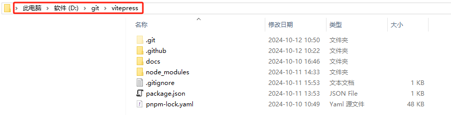
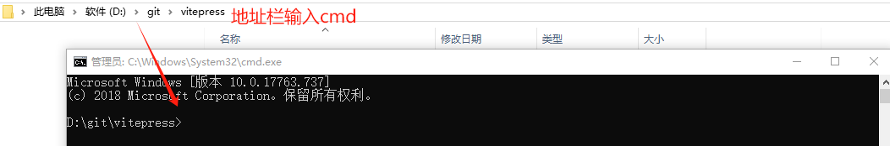
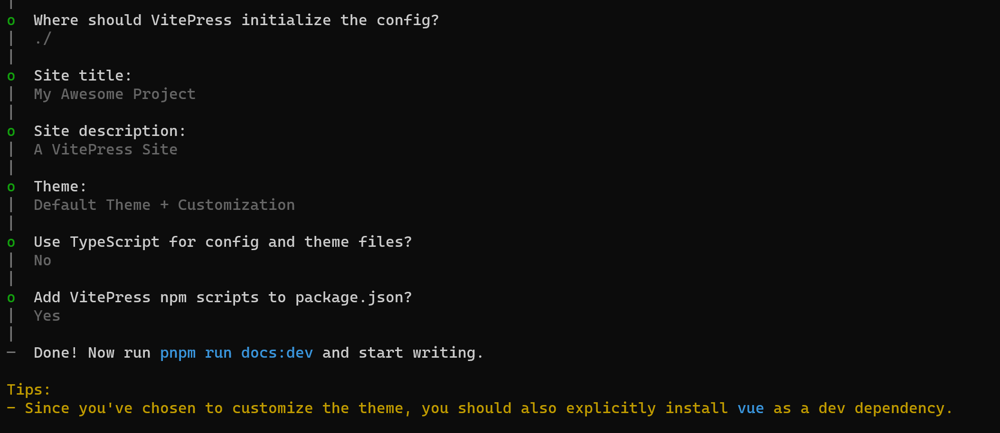
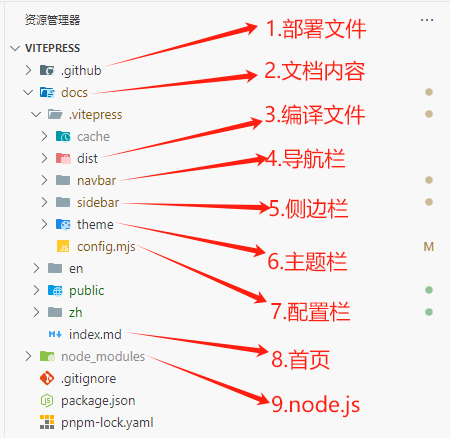

::: tip 简单介绍
VitePress 是一个基于 Vite 和 Vue 3 的静态网站生成器，特别适用于构建文档网站。它提供了快速的开发体验、即时热更新以及优秀的性能。本文将详细介绍如何安装和配置 VitePress，并通过实例代码帮助你快速上手。
:::

## **_准备工作_**

---

- 点击链接 [Node.js](https://nodejs.org/zh-cn) 进入官网选择下载 V20.18.0(LTS)稳定版，随机选择一个盘（D 盘/E 盘）进行安装。
   Node.js安装包自带npm包管理器。  
- 点击链接 [git](https://git-scm.com/) 进入官网选择下载V2.47.0版本，选择一个合适的目录安装即可。
- 安装包管理器，如 [pnpm](https://pnpm.io/zh/) , [yarn](https://classic.yarnpkg.com/en/) , [npm](https://www.npmjs.com/) ,安装命令如下：
   打开命令提示符（cmd），输入此命令即可安装pnpm包管理器：npm insatll -g pnpm，推荐使用pnpm包管理器。
- 查看当前pnpm版本命令：pnpm -v
- 查看Node.js版本命令：node -v          
- 以上准备工作全部完成后，即可开始搭建ViePress网站。
## **_快速开始_**
1. 在本地存储盘中选择一个合适的位置创建你的项目目录，例如：D:\git\vitepress


2. 在viepress文件目录的地址栏输入cmd命令，回车Enter进入终端命令提示符，如下图所示：


3. 选择如下包管理器命令，在刚刚打开的终端目录下安装vitepress。
::: code-group

```js [pnpm]
pnpm add -D vitepress
```

```js [yarn]
yarn add -D vitepress
```
:::
### 安装向导
4. VitePress 附带一个命令行设置向导，可以帮助你构建一个基本项目。安装后，通过运行以下命令启动向导：
::: code-group

```js [pnpm]
pnpm vitepress init
```

```js [yarn]
yarn vitepress init
```
:::
将需要回答几个简单的问题：


### 目录结构
如图所示：
### .git忽略项
添加 .gitignore 文件，主要用于上传到gitee/github时，忽略这些文件不上传
```js
echo node_modules >> .gitignore
echo cache >> .gitignore
echo dist >> .gitignore
```
### 启动运行
5. 该工具还应该将以下 pnpm 脚本注入到 package.json 中：
```js
{
  ...
  "scripts": {
    "docs:dev": "vitepress dev docs",
    "docs:build": "vitepress build docs",
    "docs:preview": "vitepress preview docs"
  },
  ...
}
```
6. docs:dev 脚本将启动具有即时热更新的本地开发服务器。使用以下命令运行它：
::: code-group

```js [pnpm]
pnpm run docs:dev
```

```js [yarn]
yarn run docs:dev
```
:::
### 构建测试
7. 可以运行以下命令来构建文档：
```js
pnpm run docs:build
```
8. 构建文档后，通过运行以下命令可以在本地预览它：
```js
pnpm run docs:preview
```
::: tip 温馨提示
至此，vitepress创建流程结束，您已经成功创建了自己的个人网站，请尽情撰写个人技术文档吧！
如需解决其他技术配置难题，请自行访问官网[VitePress](https://vitejs.cn/vitepress/)，如需知晓如何将网站部署到[github](https://github.com/dakeAa123456/vitepress)，请看下一章节！
:::

