# **_dake 系统问题_**

::: tip 温馨提示
此页面主要记录了日常大可订单系统在使用过程中出现的系统问题和对接到金蝶云星空系统的对接数据问题，
如下图所示会详细讲述在日常工作会遇到的问题以及解决处理办法。
:::

## **_:tada: 生产报工订单回退_**

::: info 提出问题:
<u>
操作人员在对半成品和成品生产订单报工完成后，发现报工明细有误，需要整单开始回退删除，应该怎么操作？</u>
:::

::: tip 操作步骤 1:
首先根据业务员提供的销售订单号知晓需要回退的是那个生产订单，然后复制订单编号进行下一步，此处以成品生产订单为例：
:::
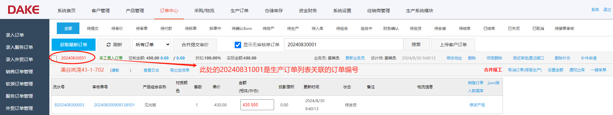

---

::: tip 操作步骤 2:
点击进入生产订单管理界面，根据复制的订单号查询生产订单（成品与半成品），
查看订单当前状态。主要有以下几种状态：1. 已下达 2. 已领料 3. 已财务报工，如果是已财务报工，说明订单已对接到金蝶云系统中，此时需要先去删除金蝶云系统中的对接数据。
:::
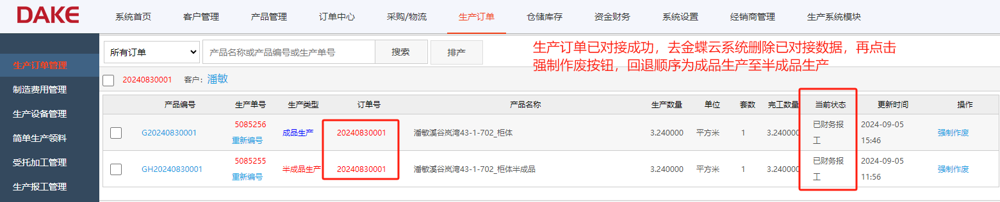

---

::: tip 操作步骤 3:
登录个人金蝶云账号，选择对应生产订单的公司组织，找到生产订单列表，粘贴在大可订单系统上复制的
生产订单号，搜索完成和核对一下，确认无误后，选择关联查询——下查，查询生产汇报单号。
:::
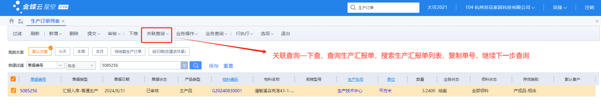

---

::: tip 操作步骤 4:
搜索生产汇报单列表，粘贴生产汇报单单号，搜索完成后，选择关联——下查，查询生产入库单号
:::
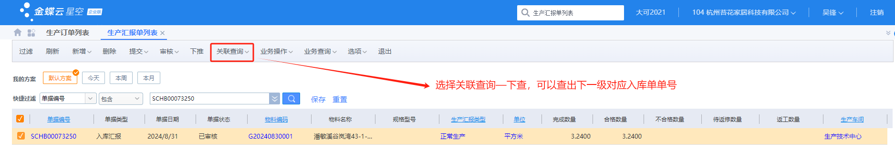

---

::: tip 操作步骤 5:
搜索生产入库单列表，粘贴生产入库单单号，此单为最后一级，搜索完成后，再次确认需要回退的
成品生产订单是否准确，确认无误后，点击反审核按钮，对入库单，汇报单，生产订单进行层级删除即可。
:::
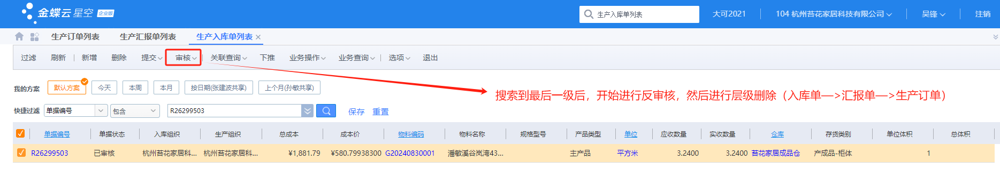

---

::: tip 操作步骤 6：
金蝶云系统里的数据全部删除后，重新回到大可订单系统的生产订单管理界面，点击强制作废按钮，依次
强制作废成品生产，半成品生产，先操作金蝶云系统里的数据，后操作大可订单系统里的数据。
:::
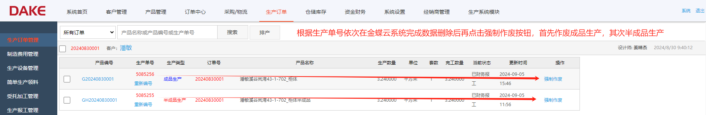

---

::: details 温馨提示
首先确认生产订单是否已经全部成功对接到金蝶云系统，如果对接成功，则需要先在金蝶云系统中删除已经对接完成的数据，
然后再手动作废大可订单系统中的订单数据，作废顺序依次为成品类型的生产订单——>半成品类型的生产订单，销售定制订单
回退到【待排产】状态即可。详细步骤如上图所示！
:::

## **_:grapes: 一个或多个错误_**

::: info 提出问题:
<u>在未对接查询功能模块，发现若干个生产订单出现的未对接原因：发生一个或多个错误，造成这个问题是因为产品 BOM 重复了，如何解决此类问题?</u>
:::
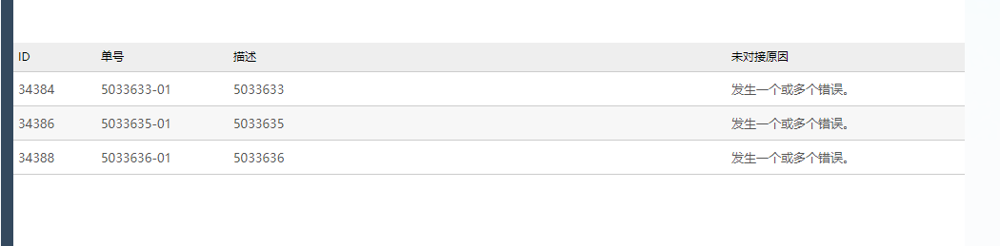

---

::: tip 操作步骤 1:
首先通过生产订单号 5085256 在生产订单管理界面查询对应的半成品（GH20240830001）和成品(G20240830001)BOM 信息。
:::
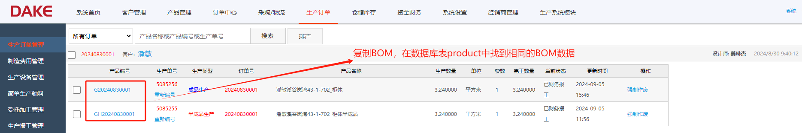

---

::: tip 操作步骤 2:
连接云服务器，进入数据库，查询数据库表 product
:::

```js title="数据库表product"
select * from dake.product a where a.ProductNo='G20240830001';
select * from dake.product a where a.ProductNo='GH20240830001';
```

---

::: tip 操作步骤 3:
根据数据库表 product，找到其中的 IsView 字段，将状态 1 改为 0，0 代表删除这条数据
:::
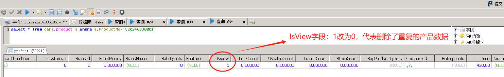

---

::: tip 操作步骤 4:
由于重复的产品 BOM 已经对接，系统已经生成了对接数据，因此需要在 kclouddatarelation 表里删除其中的对接记录。
:::

```js
select * from dake.kclouddatarelation a where a.KCloudDataNumber='G20240830001';
```

---

::: tip 操作步骤 5:
连接云服务器，进入数据库，查询 kclouddatarelation 表，根据 SourceId=productid 删除重复的数据。
:::
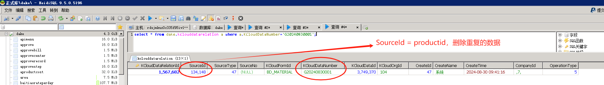

---

::: details 温馨提示
此类问题产生的根本原因是 BOM 产品信息被 WCC 系统重复上传了，导致大可系统出现数据重复，解决问题的关键就是 product 表和 kclouddatarelation 表。
:::

## **_:lemon: 业务员是必填项_**

::: info 提出问题:
<u>当销售定制订单在进行对接任务时，未对接原因：业务员是必填项，此时应当如何处理这个问题?</u>
:::

---

::: tip 操作步骤 1:
操作步骤一 ：首先根据销售定制订单号查询时那个业务员名下的客户，根据客户名称在客户档案中查询一下是否已经
维护，然后在销售定制订单管理界面找到此订单，点击更新业务员按钮，等待一段时间看看是否对接，如果未对接请继续看步骤二
:::
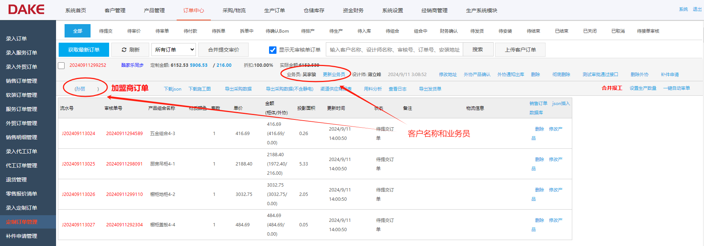

---

::: tip 操作步骤 2:
复制业务员名称，登录金蝶云星空系统，搜索员工列表功能模块，查询员工姓名，对员工的岗位进行编辑，注意所属公司组织。
:::
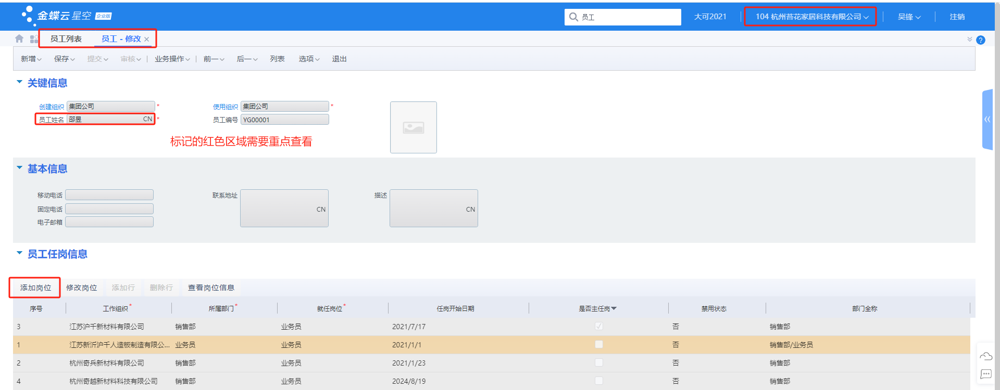

---

::: tip 操作步骤 3:
新增员工岗位后，搜索业务员列表功能模块，点击新增按钮，新增行，将新增的员工岗位添加进来，注意看清业务员岗位编码。
:::
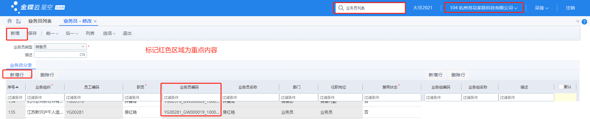

---

::: details 注意业务员岗位编码
解决此问题的关键是在金蝶云系统上新增员工岗位，然后在业务员列表功能中设置业务员岗位编码，
提交保存后，大可系统订单即可顺利对接！
:::

## **_:mandarin: 单据编号重复_**

::: info 提出问题:
dake 系统订单在进行对接时，有时候会出现销售订单编号，入库单单号，出库单单号，采购订单编号等单据编号出现重复的问题，此时应该如何处理?
:::
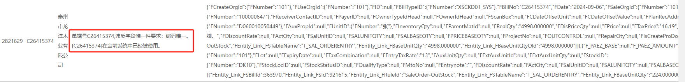

---

::: tip 操作步骤 1:
根据上图所示，未对接原因是出库单号 C26415374 出现重复，首先在大可系统中找到出库单查询功能模块，输入单号查询是否有两条同样的记录。
注意查看单据所属组织，第一次尽量选择业务中心组织下可以查询所有子公司的单据编号，注意查询的日期。
:::
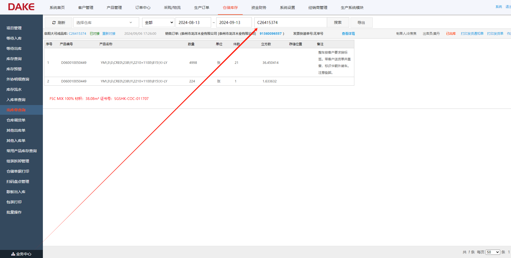

---

::: tip 操作步骤 2:
查询结果表明大可订单系统并没有两条同样单据编号的出库单，此时还有一种解决方法，登录云服务器，在数据库中输入 SQL 语句查询是否有重复记录。
:::

```ts
select * from dake.productoutstore a where a.ProductOutStoreNo='C26415374';
```

---

::: tip 操作步骤 3:
假如在云数据库中还是没有查询到重复的出库单号，此时说明大可订单系统的所有问题已经排除，接下来需要去金蝶云系统中搜索对应的功能模块，查询
是否已经对接了，但是单据状态是异常【创建状态】的，此时删除金蝶云系统里面的单据，重新在对接即可。
:::
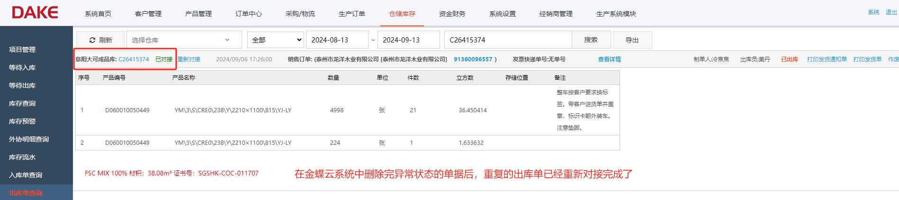

---

::: details 温馨提示
请记住处理单据编号出现重复的问题时：1.在大可订单系统，云数据库，金蝶云系统中都需要找到对应的模块查询一下是否真的出现重复数据。 2.确认单据编号重复后，部分单据可以选择重新编号按钮或者手动在数据库中修改最大单据编号。
:::

## **_:green_apple: BOM 数据为空_**

::: info 提出问题:
事业四部的销售定制订单在进行生产 BOM 合并报工，点击修改 BOM 按钮时，未查询到合并后的产品明细数据，请查明原因并解决?
:::

::: tip 操作步骤 1:
首先确认销售定制订单产品明细是否可以查询 BOM 数据，核对产品明细的编码与订单流水号是否一致，如果不一致代表产品明细有误，产品数据被修改了。
:::
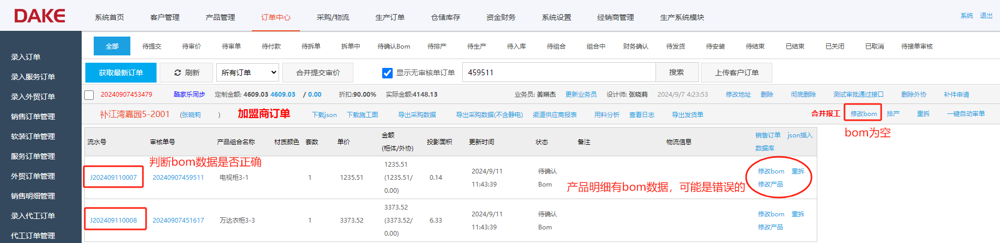

::: tip 操作步骤 2:
经过步骤 1 的核对，产品明细编码与流水号编码完全不一致，通过订单的审核单号 20240907459511 在数据库表 product 中查到两种不同编号的产品数据
选择其中与订单流水号一致的产品，修改其中的字段 IsView 由 1 改为 0。

温馨提示：IsView：0 代表将产品删除了！
:::
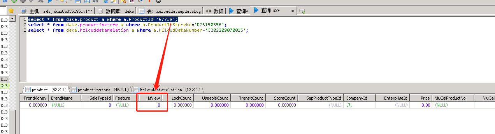

::: tip 操作步骤 3:
完成上述步骤后，回到定制订单管理页面，对每一条产品明细都进行步骤 2 的操作，然后再点击【重拆】按钮，订单状态会变成拆单中，拆单完成，数据处理中
待确认 BOM，待产品明细的数据全部处理完成，再点击主界面合并报工旁的【修改 bom】按钮查询是否有了产品明细数据的汇总。
:::
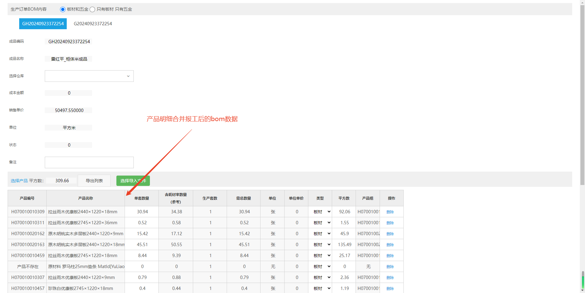

## **_:cherries: 找不到 BOM 信息_**

::: info 提出问题:
当一个生产订单 5086409 在进行对接时出现错误，未对接原因是：找不到 GH20241007004BOM 信息，苔花生产 BOM 出现错误，产品名称过长，此时应当如何处理?
:::
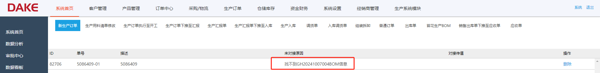
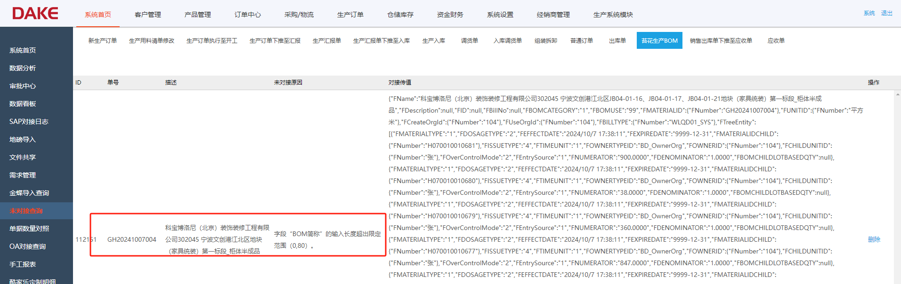
::: tip 操作步骤 1:
首先根据生产订单编号检查半成品 GH20241007004，成品 G20241007004 的 BOM 情况，是否已经正常入库，出库，领料数据是否完整正确。
:::
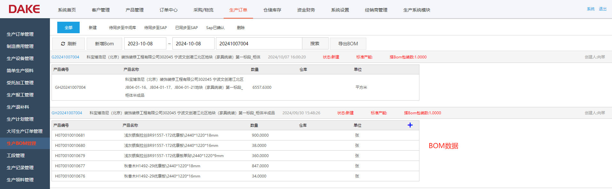
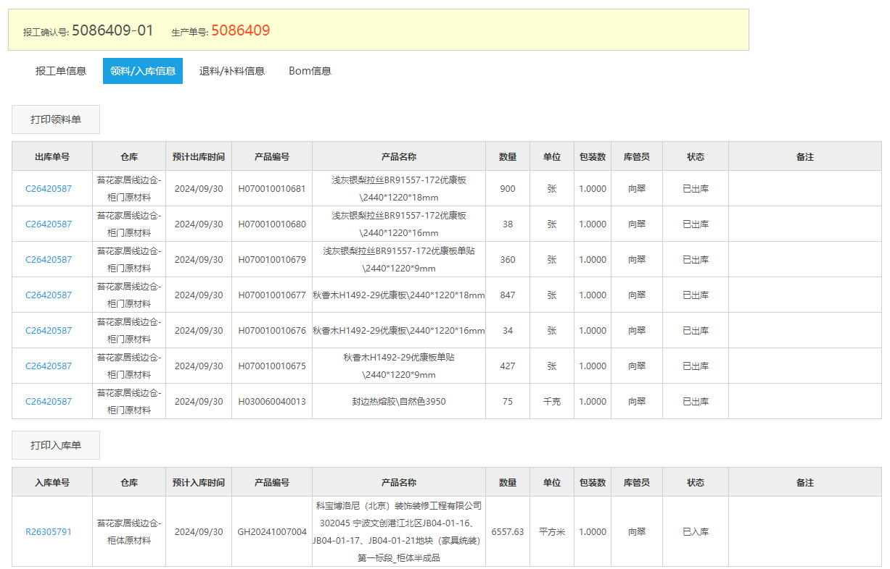

::: tip 操作步骤 2:
检查完步骤 1 确认无误后，根据上图苔花生产 BOM 未对接原因的提示，原来是金蝶云系统的字段"BOM 简称"的输入长度超出了限定范围，需要在数据库中的 productionbom 表里
修改一下名称的长度即可。
:::
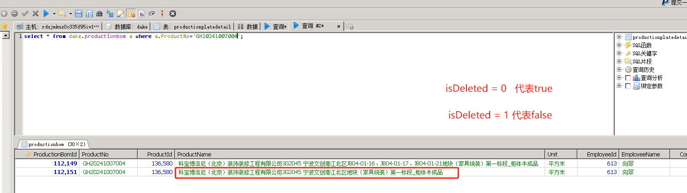
