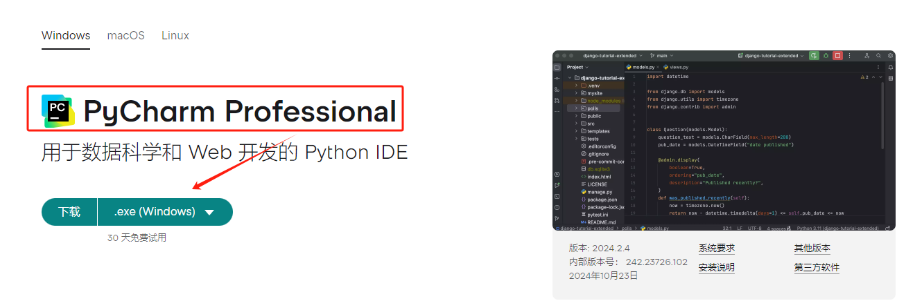
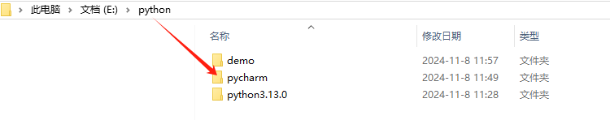
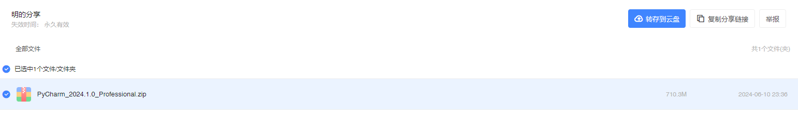
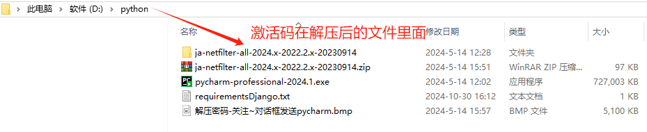
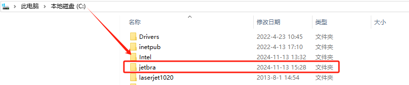
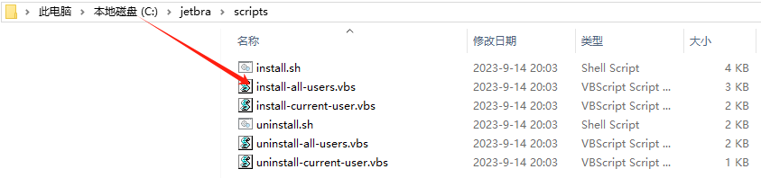
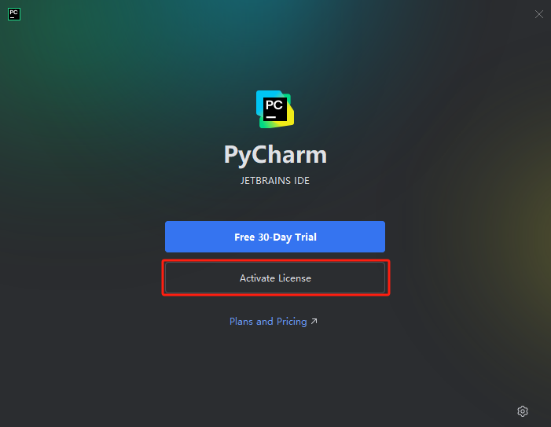
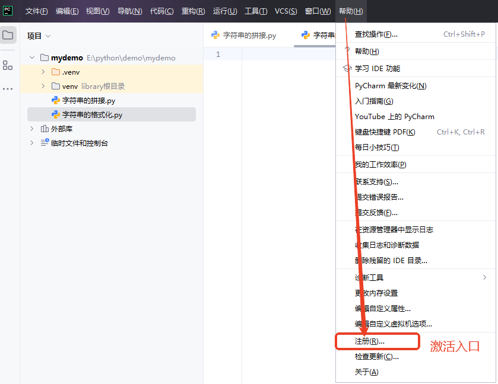
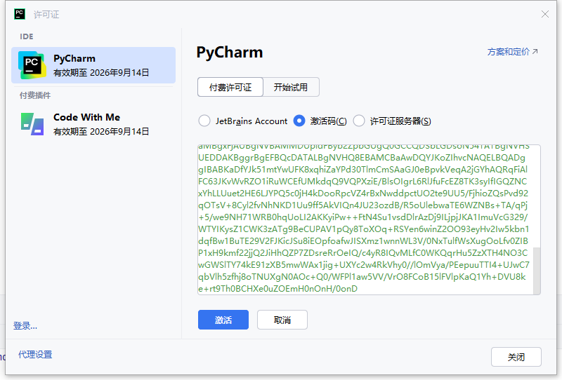

# PyCharm Professional 专业版教程

:::tip PyCharm 介绍
‌PyCharm 是由 JetBrains 开发的一款专业 Python 集成开发环境（IDE），旨在提高开发效率，特别适合专业开发人员使用。‌ 它提供了智能代码补全、实时错误检查和快速修复等功能，帮助用户更高效地编写和调试代码。‌
:::

## **_安装流程_**

1. 点击链接[PyCharm](https://www.jetbrains.com/zh-cn/pycharm/download/?section=windows)进入官网下载
   window 系统下的 PyCharm Professional（专业版）或者 PyCharm Community（社区版），推荐下载专业版。如图所示：
   
2. 将下载下来的.exe 文件进行安装，在本地存储盘中选择一个合适的位置创建你的项目目录，例如：D:\python\pycharm
   
3. 根据安装向导一步一步安装完成即可。

## **_激活流程_**

1. 点击网盘链接获取激活码[PyCharm](https://pan.xunlei.com/s/VO-59cuXlOcebwcTGYQtLcFeA1),提取码：jsbe，获取的文件如图所示：
   

2. 文件下载下来后，随机解压到一个盘里，你可以看到解压后的文件，如下所示：
   

3. 解压 ja-netfilter-all-2024.x-2022.2.x-20230914.zip
4. 将解压后文件夹内 jetbra 文件夹复制粘贴到 C 盘的根目录，永久激活插件位置：C:\jetbra\scripts （不要删除或移动位置）
   
5. 进入 C:\jetbra\scripts，双击运行 install-all-users.vbs，弹窗点击确定
   
6. 等待… （大概几十秒到几分钟，中间没有任何窗口动画，执行完成才会弹出来，请耐心等待，弹出之后才进行下一步）弹窗内出现“DONE”，点击确定
7. 启动 pycharm，首次启动提示点击“Continue”-> Don't Send，然后选择点击 Activate PyCharm 激活按钮
   
8. 打开 C:\jetbra 目录 激活码.txt，复制【PyCharm-2023.2.x】下面完整的激活码内容

```js
T7USULHBNF -
  eyJsaWNlbnNlSWQiOiJUN1VTVUxIQk5GIiwibGljZW5zZWVOYW1lIjoiZ3VyZ2xlcyB0dW1ibGVzIiwiYXNzaWduZWVOYW1lIjoiIiwiYXNzaWduZWVFbWFpbCI6IiIsImxpY2Vuc2VSZXN0cmljdGlvbiI6IiIsImNoZWNrQ29uY3VycmVudFVzZSI6ZmFsc2UsInByb2R1Y3RzIjpbeyJjb2RlIjoiUENXTVAiLCJmYWxsYmFja0RhdGUiOiIyMDI2LTA5LTE0IiwicGFpZFVwVG8iOiIyMDI2LTA5LTE0IiwiZXh0ZW5kZWQiOnRydWV9LHsiY29kZSI6IlBDIiwiZmFsbGJhY2tEYXRlIjoiMjAyNi0wOS0xNCIsInBhaWRVcFRvIjoiMjAyNi0wOS0xNCIsImV4dGVuZGVkIjpmYWxzZX0seyJjb2RlIjoiUFNJIiwiZmFsbGJhY2tEYXRlIjoiMjAyNi0wOS0xNCIsInBhaWRVcFRvIjoiMjAyNi0wOS0xNCIsImV4dGVuZGVkIjp0cnVlfV0sIm1ldGFkYXRhIjoiMDEyMDIzMDkxNFBTQVgwMDAwMDUiLCJoYXNoIjoiVFJJQUw6NzM4MzY4NjQ0IiwiZ3JhY2VQZXJpb2REYXlzIjo3LCJhdXRvUHJvbG9uZ2F0ZWQiOmZhbHNlLCJpc0F1dG9Qcm9sb25nYXRlZCI6ZmFsc2V9 -
  cjtPn2BDgvquYqMu8jD; //otufahQs2q1uOxdPwcb0JAeMRa3dIeZ6u8FJd2L3VFU2Qc4187i7SwjPVh5Xx/D0in47mPvPqxp2lPtaBOYaVUKRrudBf+9WC49Ggw9SyKgx2XkGF429ZHD6OSAQnzy6RxlJNc0IHS3p2B9u9aYc5vLkOYEluUBjdctPDbrhWQmuAd/1qMj/LRGZzdOcCHIems7igEjJvaDH9zukxMrTYCtya63uivmRFCqG7frptThq4UI9HhAWfEIkFbJDoneU/6MGRR+4mDL+wEuetnZ1oPgGFkTpQs/OQLjXDKQgqpaD+hu5bmyZhpaaWgrHhR1Ig==-MIIETDCCAjSgAwIBAgIBDTANBgkqhkiG9w0BAQsFADAYMRYwFAYDVQQDDA1KZXRQcm9maWxlIENBMB4XDTIwMTAxOTA5MDU1M1oXDTIyMTAyMTA5MDU1M1owHzEdMBsGA1UEAwwUcHJvZDJ5LWZyb20tMjAyMDEwMTkwggEiMA0GCSqGSIb3DQEBAQUAA4IBDwAwggEKAoIBAQCUlaUFc1wf+CfY9wzFWEL2euKQ5nswqb57V8QZG7d7RoR6rwYUIXseTOAFq210oMEe++LCjzKDuqwDfsyhgDNTgZBPAaC4vUU2oy+XR+Fq8nBixWIsH668HeOnRK6RRhsr0rJzRB95aZ3EAPzBuQ2qPaNGm17pAX0Rd6MPRgjp75IWwI9eA6aMEdPQEVN7uyOtM5zSsjoj79Lbu1fjShOnQZuJcsV8tqnayeFkNzv2LTOlofU/Tbx502Ro073gGjoeRzNvrynAP03pL486P3KCAyiNPhDs2z8/COMrxRlZW5mfzo0xsK0dQGNH3UoG/9RVwHG4eS8LFpMTR9oetHZBAgMBAAGjgZkwgZYwCQYDVR0TBAIwADAdBgNVHQ4EFgQUJNoRIpb1hUHAk0foMSNM9MCEAv8wSAYDVR0jBEEwP4AUo562SGdCEjZBvW3gubSgUouX8bOhHKQaMBgxFjAUBgNVBAMMDUpldFByb2ZpbGUgQ0GCCQDSbLGDsoN54TATBgNVHSUEDDAKBggrBgEFBQcDATALBgNVHQ8EBAMCBaAwDQYJKoZIhvcNAQELBQADggIBABKaDfYJk51mtYwUFK8xqhiZaYPd30TlmCmSAaGJ0eBpvkVeqA2jGYhAQRqFiAlFC63JKvWvRZO1iRuWCEfUMkdqQ9VQPXziE/BlsOIgrL6RlJfuFcEZ8TK3syIfIGQZNCxYhLLUuet2HE6LJYPQ5c0jH4kDooRpcVZ4rBxNwddpctUO2te9UU5/FjhioZQsPvd92qOTsV+8Cyl2fvNhNKD1Uu9ff5AkVIQn4JU23ozdB/R5oUlebwaTE6WZNBs+TA/qPj+5/we9NH71WRB0hqUoLI2AKKyiPw++FtN4Su1vsdDlrAzDj9ILjpjJKA1ImuVcG329/WTYIKysZ1CWK3zATg9BeCUPAV1pQy8ToXOq+RSYen6winZ2OO93eyHv2Iw5kbn1dqfBw1BuTE29V2FJKicJSu8iEOpfoafwJISXmz1wnnWL3V/0NxTulfWsXugOoLfv0ZIBP1xH9kmf22jjQ2JiHhQZP7ZDsreRrOeIQ/c4yR8IQvMLfC0WKQqrHu5ZzXTH4NO3CwGWSlTY74kE91zXB5mwWAx1jig+UXYc2w4RkVhy0//lOmVya/PEepuuTTI4+UJwC7qbVlh5zfhj8oTNUXgN0AOc+Q0/WFPl1aw5VV/VrO8FCoB15lFVlpKaQ1Yh+DVU8ke+rt9Th0BCHXe0uZOEmH0nOnH/0onD
```

---

9. 激活路径：打开 PyCharm 编辑器，找到主界面的导航栏——>帮助——>注册，如下图所示：

---



---

10. 激活成功如图所示：

---


