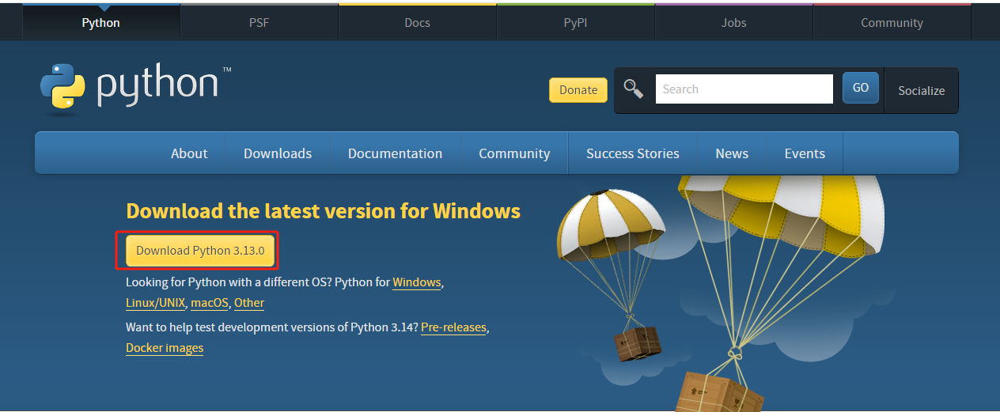
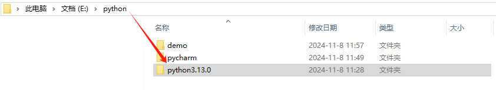

</img><h1>Python 安装教程</h1>

:::tip Python 介绍 <Badge type="danger" text="v3.13.0" />
‌Python 是一种面向对象、解释型的计算机编程语言,它的语法简洁明了，具有良好的可读性和可扩展性，是当下最热门的编程语言！
而且它的作用极其丰富，被广泛应用于科技，金融，计算机等领域，在各行各业中发挥了重要作用。例如：数据分析/可视化，网络爬虫
人工智能，AI 机器人，智能驾驶，3D 游戏开发等方面都有 Python 做出的贡献，世界因 Python 而更美好！
:::

## **_快速开始_**

1. 点击链接[Python](https://www.python.org/downloads/)进入官网下载最新版本（3.13.0），如下图所示：
   

2. 将下载下来的.exe 文件进行安装，在本地存储盘中选择一个合适的位置创建你的项目目录，例如：D:\python\python3.13.0
   
3. 根据安装向导一步一步安装完成即可。

## pycharm 工具安装视频链接：

> https://www.bilibili.com/video/BV1qW4y1a7fU?spm_id_from=333.788.videopod.episodes&vd_source=0ce952d9877a1661b784ea965e0219d9&p=4

