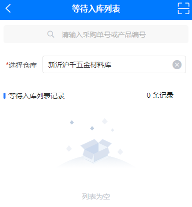
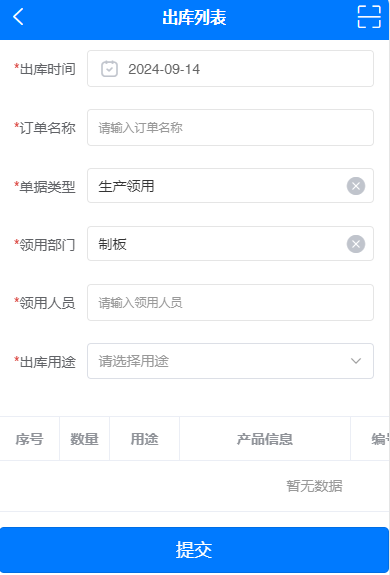
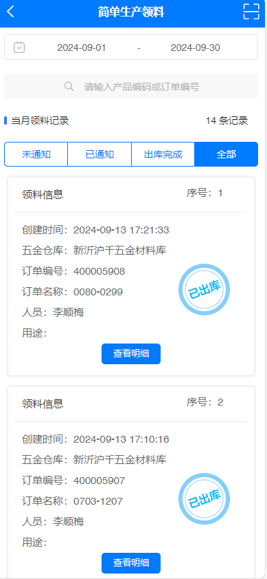
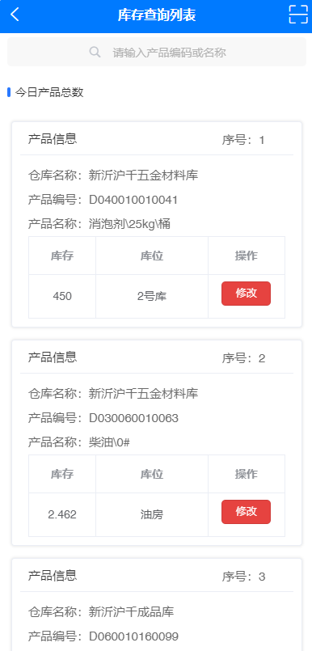
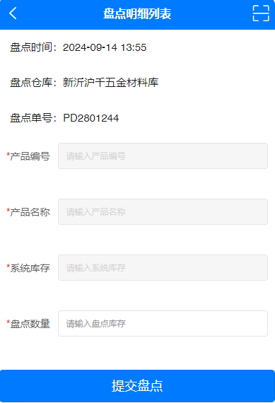

# **_扫码出入库系统-五金仓库 :whale:_**

## **_:melon: 等待入库_**

::: tip 功能介绍
此功能模块的主要作用是获取等待采购入库单的产品明细，当采购员提交采购订单，通知仓管员准备入库后，采购入库单产品明细会自动
传输到此功能模块，仓管员收到实物后清点产品数量，确认无误后即可点击入库按钮，产品入库完成。

温馨提示：入库前需要注意选择正确的仓库！
:::

## **_入库列表_**

```bash
http://test.api.99niucai.com/store/in/waitlist?houseId=199&key=R26301732
```

## **_入库明细_**

```bash
http://test.api.99niucai.com/store/in/detail?id=5187
```

## **_入库提交_**

```bash
http://test.api.99niucai.com/store/in/over?ProductInStoreId=5189
```

## **_请求方式_**

```bash
GET OR  POST
```

## **_请求参数_**

|      参数名      |  参数值   | 是否必填 | 参数类型 |  描述说明   |                                         文档接口                                         |
| :--------------: | :-------: | :------: | :------: | :---------: | :--------------------------------------------------------------------------------------: |
|     houseId      |    199    |    是    |  Number  | 所选仓库 ID |                                                                                          |
|       key        | R26301732 |    是    |  String  |   搜索值    | [入库列表](https://doc.apipost.net/docs/detail/3363e4134064000?target_id=20a6efd73d902e) |
|        id        |   5187    |    是    |  Number  | 入库明细 ID | [入库明细](https://doc.apipost.net/docs/detail/3366f480bc64000?target_id=366ddad0bbb04b) |
| ProductInStoreId |   5189    |    是    |  Number  |  页面传参   | [入库提交](https://doc.apipost.net/docs/detail/336804e9e464000?target_id=367ee526fbb073) |

<!-- # ***功能示例***
***
 -->

<!-- - 搜索框：请输入采购单号或产品编号
- 选择仓库：新沂沪千五金材料库
- 等待入库记录列表
*** -->

::: info 注意事项
入库前，请仔细核对采购入库单号和产品明细，确认无误后方可点击提交入库按钮，如发现产品明细有误，请联系采购员退回，重新提交采购订单，感谢您的支持与配合！
:::

## **_:orange: 领料出库_**

::: tip 功能介绍
此功能模块的主要作用是使用 PDA 扫码设备扫描产品二维码，输入如下图所示相关信息，待扫码完成，产品信息确认无误后点击提交按钮，系统会自动生成一张领料出库单，
在大可订单系统中的简单生产领料功能模块中可以查询扫码生成的领料出库单据。

温馨提示：简单生产领料出库已支持手机端和 PC 端！
:::

## **_产品信息_**

```bash
http://test.api.99niucai.com/product/getproduct?id=D010010061074
```

## _请求方式_

```bash
GET
```

## _请求参数_

| 参数名 |    参数值     | 是否必填 | 参数类型 | 描述说明 |                                         文档接口                                         |
| :----: | :-----------: | :------: | :------: | :------: | :--------------------------------------------------------------------------------------: |
|   id   | D010010061074 |    是    |  String  | 产品编号 | [产品信息](https://doc.apipost.net/docs/detail/336790378864000?target_id=36785a483bb059) |

## **_提交领料_**

```bash
http://test.api.99niucai.com/production/postproductrepair
```

## _请求方式_

```bash
POST
```

## _请求参数_

|  参数名   | 参数值 | 是否必填 | 参数类型 |    描述说明    |                                         文档接口                                         |
| :-------: | :----: | :------: | :------: | :------------: | :--------------------------------------------------------------------------------------: |
| Json 数据 |  Data  |    是    |   Json   | 传入 Json 数据 | [提交领料](https://doc.apipost.net/docs/detail/33674e129464000?target_id=3672a4fb3bb054) |

<!-- # ***功能示例***
***
 -->

<!-- - 出库时间：2024-09-14
- 订单名称：0080-0299
- 单据类型：生产领用
- 领用部门：制板
- 领用人员：李顺梅
- 出库用途：热能中心 -->

<!-- | 序号     |   数量    |   用途     | 产品信息           |  产品编号        |  单位     |  操作     |
|:-------: |:-------: | :-------:  |:-------:          |:-------:         |:-------: |:-------: |
|   1    |    10      |  热能中心   |  销轴\60*230       | D010010061074   |  	根	   |    删除   |
|   2    |    50      |  热磨       |磨片\50-4SH\特材    | D010050020007   |  	副	   |    删除   | -->

## **_:watermelon: 等待出库_**

::: tip 功能介绍
此功能模块的主要作用是对新建的简单领料出库单进行状态管理，仓库管理员对新建订单点击查看明细按钮进行产品核对，待确认无误后通知出库即可。
在大可订单系统中的等待出库功能界面可以查询到刚刚提交的出库单，仓管员再次核对出库产品名称，数量，然后，点击出库按钮即可。

温馨提示：请注意查看出库产品的数量和所在仓库的产品剩余库存数量，切勿出库完成后产品库存为负数！
:::

## **_等待出库_**

```bash
http://test.api.99niucai.com/production/productrepairlist?begin=2024-09-01&end=2024-09-30&key=D010010061074&pindex=1&psize=10&status=1
```

## **_请求方式_**

```bash
GET
```

## **_请求参数_**

| 参数名 |    参数值     | 是否必填 | 参数类型 |    描述说明    |                                         文档接口                                         |
| :----: | :-----------: | :------: | :------: | :------------: | :--------------------------------------------------------------------------------------: |
| begin  |  2024-09-01   |    是    |   Date   |    月初日期    |                                                                                          |
|  end   |  2024-09-30   |    是    |   Date   |    月末日期    |                                                                                          |
|  key   | D040010010041 |    是    |  String  |     搜索值     |                                                                                          |
| pindex |       1       |    是    |  Number  |     第几页     |                                                                                          |
| psize  |      10       |    是    |  Number  | 每页获取多少条 |                                                                                          |
| status |       1       |    是    |  Number  |    数据状态    | [等待出库](https://doc.apipost.net/docs/detail/3367dd3fc864000?target_id=367b5e42fbb05e) |

---

<!-- # ***功能示例***
***
 -->

## **_:apple: 库存查询_**

::: tip 功能介绍
此功能模块的主要作用是对新沂沪千五金材料库的产品信息可通过扫描产品二维码的方式查询出来，包括产品的库存数量和存储位置，以及对存储位置的实时修改，更加方便与灵活的掌握产品库存数据！
:::

## _产品库存_

```bash:no-line-numbers
http://test.api.99niucai.com/store/storelist?houseId=199&key=D04001001&pindex=1&psize=10
```

## **_请求方式_**

```bash
GET
```

## **_请求参数_**

| 参数名  |    参数值     | 是否必填 | 参数类型 |    描述说明    |                                         文档接口                                         |
| :-----: | :-----------: | :------: | :------: | :------------: | :--------------------------------------------------------------------------------------: |
| houseId |      199      |    是    |  Number  |  所选仓库 ID   |                                                                                          |
|   key   | D040010010041 |    是    |  String  |     搜索值     |                                                                                          |
| pindex  |       1       |    是    |  Number  |     第几页     |                                                                                          |
|  psize  |      10       |    是    |  Number  | 每页获取多少条 | [产品库存](https://doc.apipost.net/docs/detail/336680b96064000?target_id=20a3e63abd901b) |

---

## _修改库位_

```bash
http://test.api.99niucai.com/store/updatelocation
```

## _请求方式_

```bash
POST
```

## _请求参数_

|  参数名   | 参数值 | 是否必填 | 参数类型 |    描述说明    |                                         文档接口                                         |
| :-------: | :----: | :------: | :------: | :------------: | :--------------------------------------------------------------------------------------: |
| Json 数据 |  Data  |    是    |   Json   | 传入 Json 数据 | [修改库位](https://doc.apipost.net/docs/detail/3366b74acc64000?target_id=20a4eca6bd9023) |

<!-- # ***功能示例***
***

*** -->

## **_:grapes: 盘点管理_**

::: tip 功能介绍
此功能模块的主要作用是针对定期对五金仓库的所有产品库存进行统一盘点，为了防止有产品盘点遗漏而开发的功能，此功能会详细记录每一次盘点的单个产品信息，可以导出 Excel 盘点表进行筛选相关产品记录。

温馨提示：使用此功能前，需要在电脑端手动创建五金仓库的盘点表，此盘点表包含了所有所属仓库的产品信息！
:::

## _盘点列表_

```bash:no-line-numbers
http://test.api.99niucai.com/store/inventory/list?houseId=199&key=无&pindex=1&psize=10

```

## _盘点明细_

```bash
http://test.api.99niucai.com/store/inventory/wait?id=571
```

## _盘点产品_

```bash
http://test.api.99niucai.com/store/inventory/detail?id=199&key=D010010010052
```

## **_请求方式_**

```bash
GET
```

## **_请求参数_**

| 参数名  |    参数值     | 是否必填 | 参数类型 |    描述说明    |                                         文档接口                                         |
| :-----: | :-----------: | :------: | :------: | :------------: | :--------------------------------------------------------------------------------------: |
| houseId |      199      |    是    |  Number  |  所选仓库 ID   |                                                                                          |
|   key   | D010010010052 |    是    |  String  |     搜索值     |                                                                                          |
| pindex  |       1       |    是    |  Number  |     第几页     | [盘点列表](https://doc.apipost.net/docs/detail/3363e4134064000?target_id=20a6efd73d902e) |
|  psize  |      10       |    是    |  Number  | 每页获取多少条 | [盘点明细](https://doc.apipost.net/docs/detail/3365b27c1c64000?target_id=20a631673d902b) |
|   id    |      571      |    是    |  Number  |  产品明细 ID   | [盘点产品](https://doc.apipost.net/docs/detail/336604421064000?target_id=20a970b13d9034) |

## _提交盘点_

```bash
http://test.api.99niucai.com/store/inventory/update
```

## _请求方式_

```bash
POST
```

## _请求参数_

|  参数名   | 参数值 | 是否必填 | 参数类型 |    描述说明    |                                         文档接口                                         |
| :-------: | :----: | :------: | :------: | :------------: | :--------------------------------------------------------------------------------------: |
| Json 数据 |  Data  |    是    |   Json   | 传入 Json 数据 | [提交盘点](https://doc.apipost.net/docs/detail/3366306b0864000?target_id=20aaab5b7d9037) |

<!-- # ***功能示例***
***
 -->
