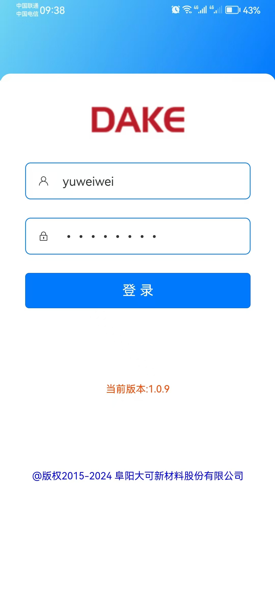
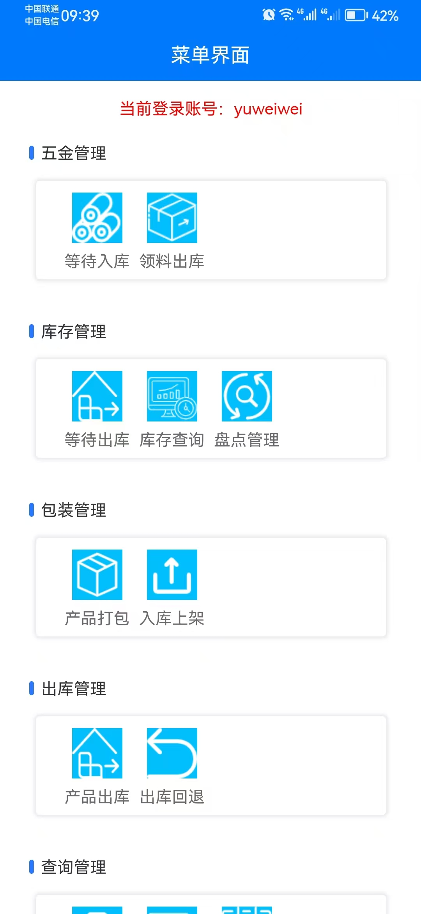
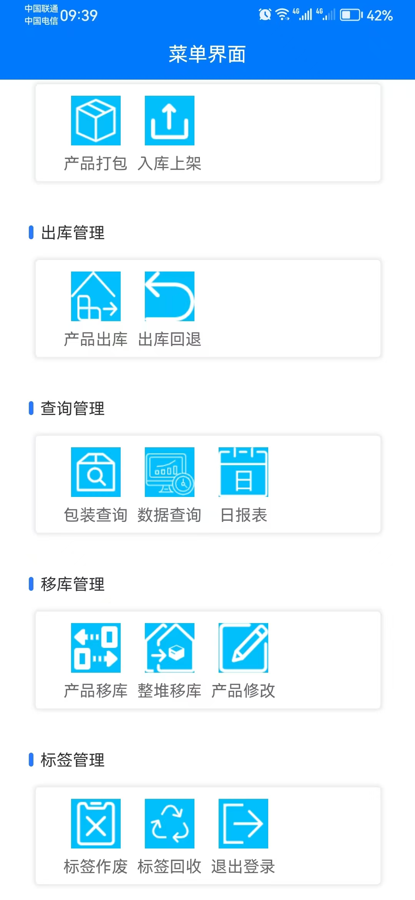

# **_扫码出入库系统-项目介绍_**

::: tip 使用说明
在实际生产操作环境中，对某个产品赋予一个产品标签，生成一个二维码标识，工作人员对二维码进行扫码入库，出库，上架，下架，盘点等一系列操作，提高了工作效率，优化了业务流程，使用简单，方便快捷，扫码的运用在现代企业生产中发挥着越来越重要的作用！

- 可对实际生产好的成品进行后续服务跟踪，生成的二维码信息中，包含了产品的基本信息（产品编号，产品名称，包装数量等），生产检验记录的信息（生产订单号，生产时间，生产批次等），均可通过扫码查询。
- 可直接通过扫描二维码进行仓库盘点，解决仓库的盘点困难等问题。
- 出库时可直接进行扫码出库，同时也可以直接跟踪出库产品的生产批次等信息。
  :::

## **_项目部分截图 :dolphin:_**

## 首页介绍-登录页

## 菜单界面-五金仓

## 菜单界面-成品仓

