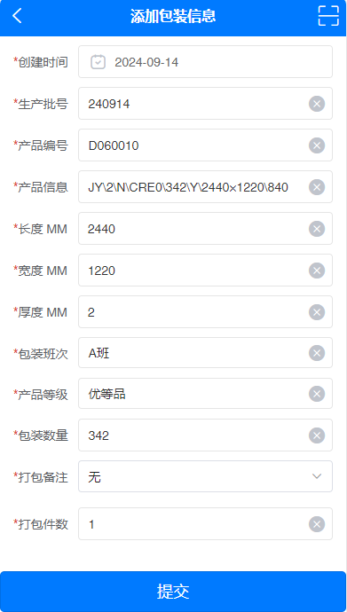
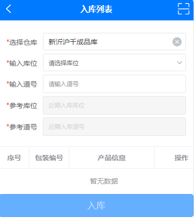
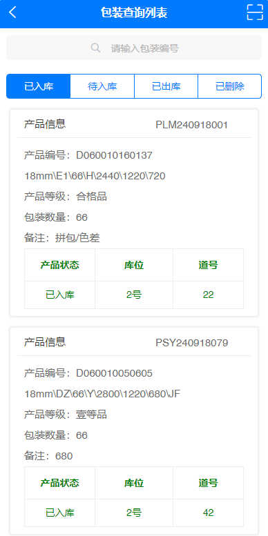
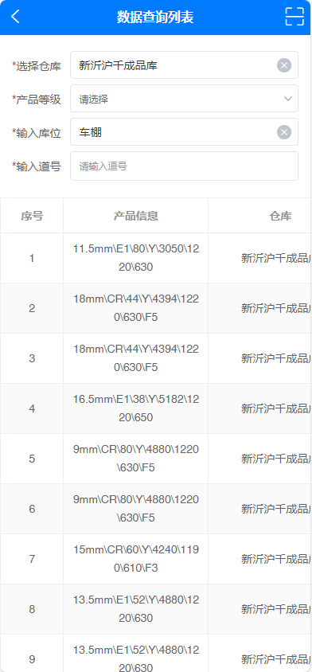
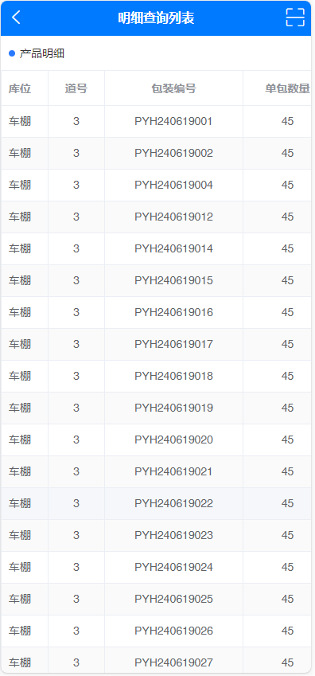
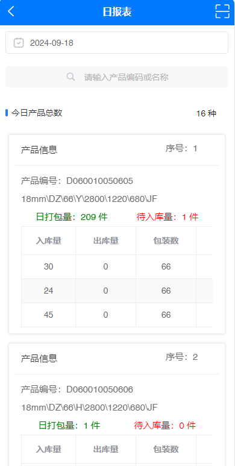

# **_扫码出入库系统-检验入库 :whale2:_**

## **_:melon: 产品打包_**

::: tip 功能介绍
此功能模块的主要作用是录入产品信息，系统自动生成包装编号，通过包装编号打印出专属包装二维码，包装编号与二维码一一对应，每一个包装编号都有独立的
二维码，工作人员通过使用 PDA 设备扫描此二维码，可以查询包装信息，包括是否入库，出库，存储位置等等。

温馨提示：打包前请仔细确认打包的产品编号是否正确，此外，产品打包已支持手持（PDA）端和电脑（PC）端！
:::

## _产品列表_

```bash
http://test.api.99niucai.com/product/getproduct
```

## _产品等级_

```bash
http://test.api.99niucai.com/listitem
```

## _产品班次_

```bash
http://test.api.99niucai.com/listitem
```

## _产品备注_

```bash
http://test.api.99niucai.com/listitemkey
```

## _提交打包_

```bash
http://test.api.99niucai.com/production/postpackingnew
```

## **_请求方式_**

```bash
GET OR POST
```

## **_请求参数_**

| 参数名 |    参数值     | 是否必填 | 参数类型 | 描述说明 |                                         文档接口                                         |
| :----: | :-----------: | :------: | :------: | :------: | :--------------------------------------------------------------------------------------: |
| packno | D030020010244 |    是    |  String  | 产品编号 | [产品列表](https://doc.apipost.net/docs/detail/337767997064000?target_id=376f08f1bbb002) |
| listId |      60       |    是    |  Number  | 等级编码 | [产品等级](https://doc.apipost.net/docs/detail/33776d626064000?target_id=377127797bb008) |
| listId |      57       |    是    |  Number  | 班次编码 | [产品班次](https://doc.apipost.net/docs/detail/3377725ab864000?target_id=37717c997bb00c) |
| listId |      61       |    是    |  Number  | 备注编码 | [产品备注](https://doc.apipost.net/docs/detail/337777870064000?target_id=37724b6d7bb010) |
|  key   |      无       |    否    |  String  | 备注内容 | [提交打包](https://doc.apipost.net/docs/detail/33777cf8f064000?target_id=376bc8e13bb000) |

<!-- # ***功能示例***
***
 -->

## **_:pear: 入库上架_**

::: tip 功能介绍
此功能模块的主要作用是将打包好的产品包装，根据以往的参考库位和道号，录入到系统对应的仓库，库位，道号，方便以后可以更加快速地查询！
:::

## _选择库位_

```bash
http://test.api.99niucai.com/house/posselect
```

## _最近入库_

```bash
http://test.api.99niucai.com/production/getpakingnewlast
```

## _扫码产品_

```bash
http://test.api.99niucai.com/production/getpackingnew
```

## _提交入库_

```bash
http://test.api.99niucai.com/production/postpackingnewstatus
```

## **_请求方式_**

```bash
GET OR POST
```

## **_请求参数_**

|   参数名   |    参数值     | 是否必填 | 参数类型 | 描述说明 |                                         文档接口                                         |
| :--------: | :-----------: | :------: | :------: | :------: | :--------------------------------------------------------------------------------------: |
| housePosId |      199      |    是    |  Number  | 仓库编号 | [选择库位](https://doc.apipost.net/docs/detail/33787fbc5464000?target_id=377c79e6bbb021) |
|  logType   |       1       |    是    |  Number  |  状态码  | [最近入库](https://doc.apipost.net/docs/detail/337882cde464000?target_id=377e54767bb02d) |
| packingNo  | PYH240920001  |    是    |  String  | 包装编号 | [扫码产品](https://doc.apipost.net/docs/detail/337884cf9c64000?target_id=377d3976fbb025) |
|   status   |       0       |    是    |  Number  |  状态码  | [提交入库](https://doc.apipost.net/docs/detail/337886432c64000?target_id=377aa62f3bb01a) |
|    key     | D060019990603 |    是    |  String  | 产品编号 |                                                                                          |
|  houseId   |      144      |    是    |  Number  | 库位编号 |                                                                                          |
|  location  |       A       |    是    |  String  |   道号   |                                                                                          |
|    ids     |     85952     |    是    |  Number  |   主键   |                                                                                          |

<!-- # ***功能示例***
***
 -->

## **_:peach: 包装查询_**

::: tip 功能介绍
此功能模块的主要作用是查询单个包装编号的所属信息，比如产品编号，产品名称，产品等级，包装数量，备注，产品状态，库位，道号等等信息！
:::

## _包装查询_

```bash
http://test.api.99niucai.com/production/getpackingnew
```

## **_请求方式_**

```bash
GET
```

## **_请求参数_**

| 参数名 |    参数值    | 是否必填 | 参数类型 |  描述说明  |                                         文档接口                                         |
| :----: | :----------: | :------: | :------: | :--------: | :--------------------------------------------------------------------------------------: |
|  key   | PYH240920001 |    是    |  String  |  包装编号  |                                                                                          |
| status |      1       |    是    |  Number  |   状态码   |                                                                                          |
| pindex |      1       |    是    |  Number  |   第几页   |                                                                                          |
| psize  |      10      |    是    |  Number  | 每页多少条 | [包装查询](https://doc.apipost.net/docs/detail/337a0bcbac64000?target_id=378b04e4bbb03a) |

<!-- # ***功能示例***
 -->

## **_:cherries: 数据查询_**

::: tip 功能介绍
此功能模块的主要作用是根据输入不同的搜索条件查询出各种各样的产品信息，比如选择仓库，产品等级，库位和道号等搜索条件，选择其中一条数据，点击
操作按钮可查看包装编号的明细！
:::

## _查询库存_

```bash
http://test.api.99niucai.com/production/getpakingnewstore
```

## **_请求方式_**

```bash
GET
```

## **_请求参数_**

|   参数名   | 参数值 | 是否必填 | 参数类型 |  描述说明   |                                         文档接口                                         |
| :--------: | :----: | :------: | :------: | :---------: | :--------------------------------------------------------------------------------------: |
|  levelId   |  466   |    是    |  Number  | 产品等级 ID |                                                                                          |
|  houseId   |  199   |    是    |  Number  |   仓库 ID   |                                                                                          |
|  location  |   A    |    是    |  String  |    道号     |                                                                                          |
| housePosId |  166   |    是    |  Number  |   库位 ID   | [查询库存](https://doc.apipost.net/docs/detail/337c3696ac64000?target_id=37a213fd7bb046) |

<!-- # 主表
 -->

## _库存明细_

```bash
http://test.api.99niucai.com/production/getpakingnewstoredetail
```

## **_请求参数_**

| 参数名 |  参数值  | 是否必填 | 参数类型 |      描述说明      |                                         文档接口                                         |
| :----: | :------: | :------: | :------: | :----------------: | :--------------------------------------------------------------------------------------: |
|  Data  | \*\*\*\* |    是    |   Json   | 传 Json 格式的数据 | [库存明细](https://doc.apipost.net/docs/detail/337abcb8dc64000?target_id=37a7bb06fbb054) |

<!-- # 明细表
 -->

## **_:strawberry: 日报表_**

::: tip 功能介绍
此功能模块的主要作用是统计当日扫码出入库的详细数据，包括日打包量，待入库量，入库量，出库量，移入量，移出量，删除量等等产品数据！
:::

## _日报表_

```bash
http://test.api.99niucai.com/production/getpakingnewreport?startTime=2024-09-01&endTime=2024-09-30&key=PYH240920001
```

## **_请求方式_**

```bash
GET
```

## **_请求参数_**

|  参数名   |    参数值    | 是否必填 | 参数类型 | 描述说明 |                                        文档接口                                        |
| :-------: | :----------: | :------: | :------: | :------: | :------------------------------------------------------------------------------------: |
| startTime |  2024-09-01  |    是    |   date   | 开始日期 |                                                                                        |
|  endTime  |  2024-09-30  |    是    |   date   | 结束日期 |                                                                                        |
|    key    | PYH240920001 |    是    |  String  | 包装编号 | [日报表](https://doc.apipost.net/docs/detail/337c5ab62c64000?target_id=37c3bb713bb057) |

<!--  -->
