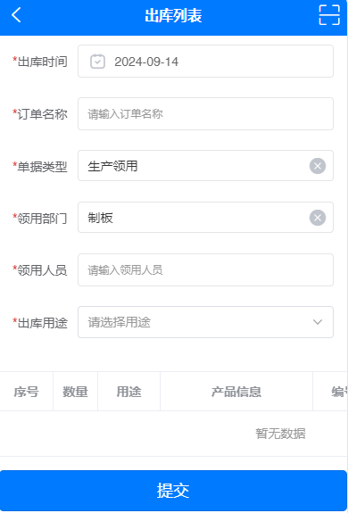
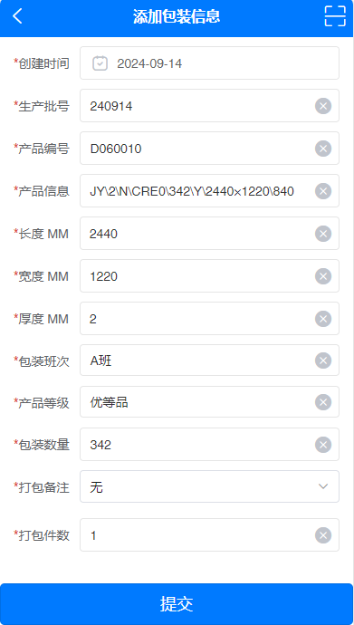
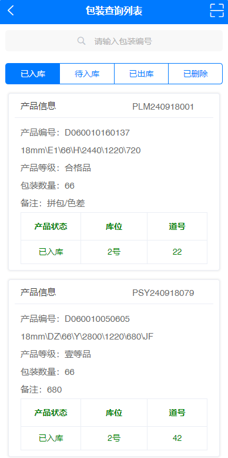
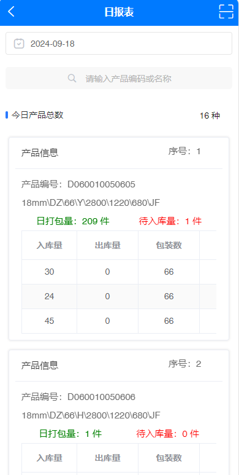

# **_扫码出入库系统-原型图例_**

## 1. 等待入库

## 2. 领料出库

## 3. 等待出库

## 4. 库存查询

## 5. 盘点管理

## 6. 产品打包

## 7. 入库上架

## 8. 产品出库

## 9. 出库回退

## 10. 包装查询

## 11. 日报表

## 12. 数据查询

## 13. 明细查询列表

## 14. 产品修改

## 15. 产品修改明细

## 16. 产品移库

## 17. 整堆移库

## 18. 标签作废

## 19. 标签回收

