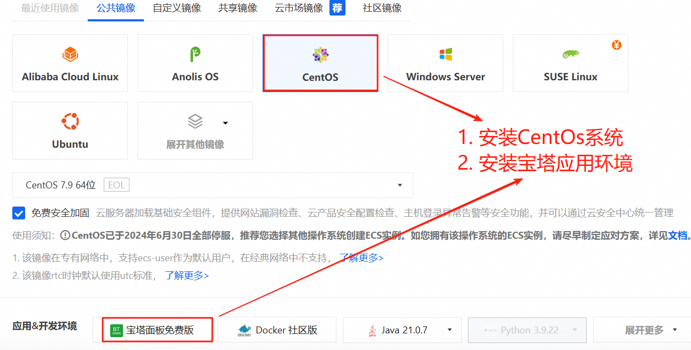
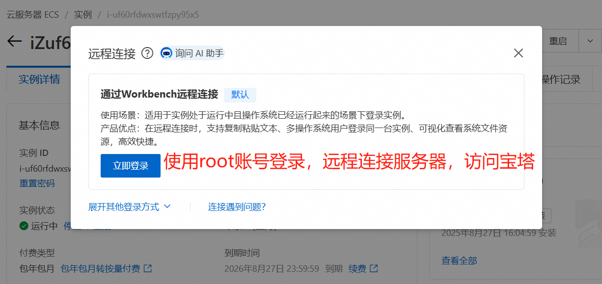
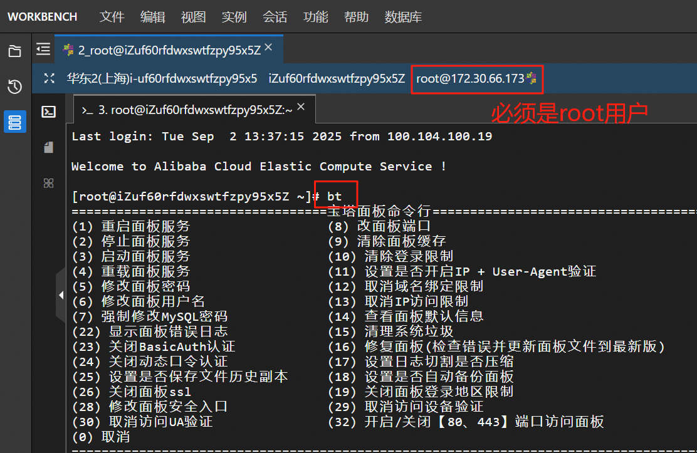
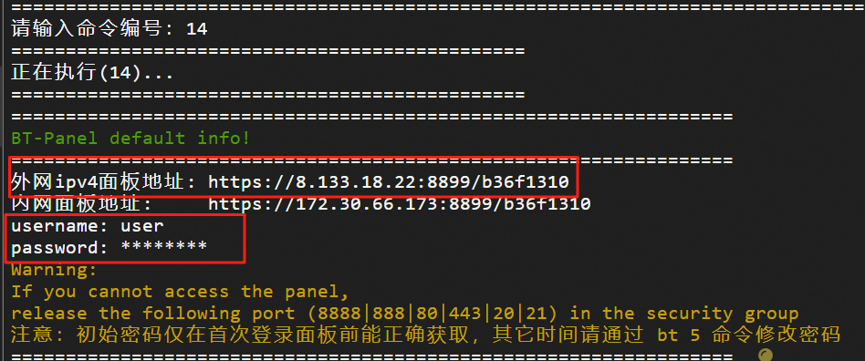
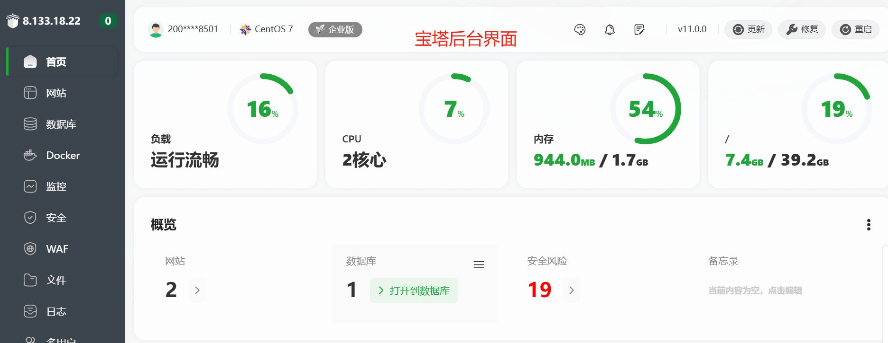
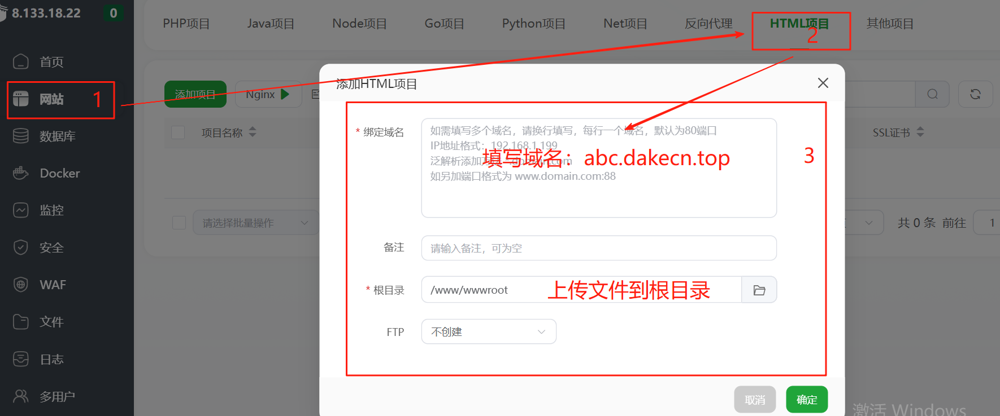
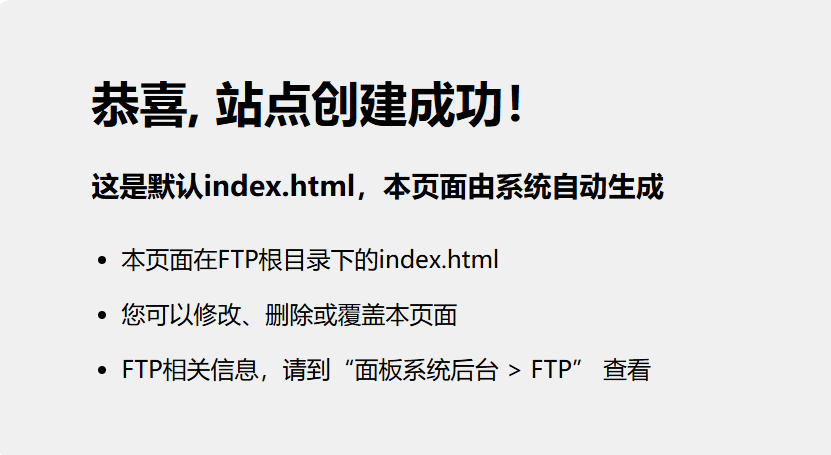
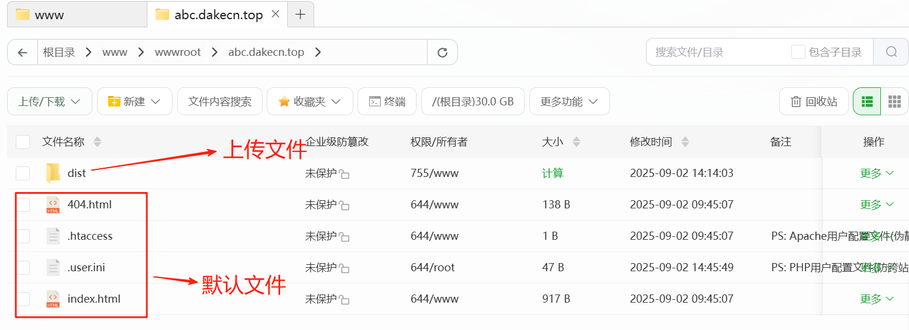
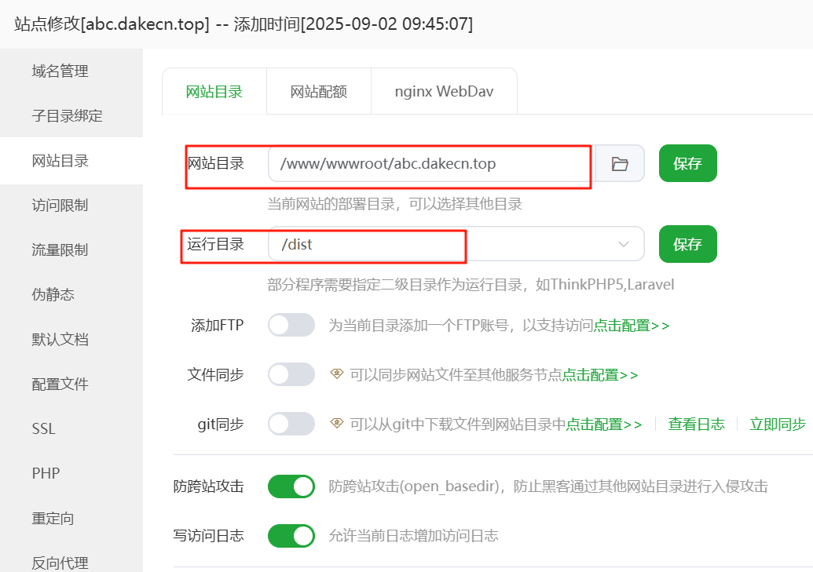

::: tip 简单介绍
本文档主要介绍如何将本地正常运行且已经打包好的项目上传到传统服务器中使用自己的域名进行访问。从购买服务器，到终端部署等等都会详细解答，如有不当之处，欢迎留言指正！
:::

## **_快速开始_**

---
### 1. 点击链接进入官网[阿里云](https://www.aliyun.com/)购买ECS服务器，具体配置可自行选择，安装系统(centOs7.9 64位)和应用环境(宝塔面板)如下图所示：

   

### 2. 服务器购买成功后，开始远程连接服务器。



### 3. 输入root账号和密码，密码如果忘记，可根据提示重置密码，登录成功后，如下图所示



```js
输入终端命令：bt
```
### 4. 选择宝塔面板编号：14，查看默认面板信息，得到面板地址，账号和初始密码，如图所示：



```js
输入终端命令：14
```
### 5. 复制面板地址到浏览器中访问，输入账号和初始密码，正式进入宝塔面板后台管理界面，如图所示：



### 6. 进入后台，选择网站目录，根据自己的项目是什么编程语言写的而选择哪个，输入自己的域名，请勿照抄图例域名（已经失效）我这里选择了HTML项目，这是一个纯前端项目，如下图所示：



### 7. 站点创建成功后，可以尝试点击尝试一下是否可以访问一个默认页面，如果能访问代表站点创建成功，域名解析成功，访问成功的页面如下图所示：


<details>
  <summary>温馨提示，点击这里查看更多关于域名解析信息</summary>

> - <sapn class="marker-evy">关于域名DNS解析请记得将记录类型设置为A--将域名指向一个IPv4地址</sapn>
 > - <sapn class="marker-evy">主机记录值改为服务器公网IP</sapn>
> - <sapn class="marker-evy">如还有其他错误，请自行百度</sapn>
</details>

### 8. 点击站点的根目录，开始上传文件到WWWroot目录下，创建站点时，系统会创建四个默认文件，无需理会，只需要关注我们上传的文件即可，如下图所示：



### 9. 在本地运行官网项目时，首先打开vscode，找到项目文件，点击运行终端，输入如下命令即可在本地运行官网项目。

```js
  pnpm run docs:dev
```
### 10. 项目内容全部写好后，需要部署到服务器时，需要对整个项目进行打包，打包完成后会得到一个dist文件，去服务器上传此文件即可，打包命令如下：

```js
  pnpm run docs:build
```
### 11. 当打包好的文件上传到服务器的根目录下，点击域名还是无法访问内容或数据没有css样式时，问题的根源应该是域名根路径出错，导致浏览器无法加载这些资源，解决办法如下：
- 正确配置VuePress 的 `base` 选项 (最关键！)必须在项目的` docs/.vuepress/config.js `文件中设置正确的 `base `选项。
```js
// docs/.vuepress/config.js
module.exports = {
  // 最重要的配置：base
  // 如果你部署到域名的根路径，比如 https://example.com/，则设置为 '/'
  // 如果你部署到子路径，比如 https://example.com/my-docs/，则设置为 '/my-docs/'
  base: '/my-docs/', // 请将 '/my-docs/' 替换为你实际的访问路径

  title: '我的文档', // 标题
  description: 'VuePress 部署测试', // 描述
  // ... 其他配置
}
```

### 12. 检查服务器 Nginx 配置,如果你的 `base `设置为` '/'`（即部署到根目录），但访问` http://your-server.com/ `仍然没有样式，请检查 Nginx 配置是否正确指向了上传的目录。检查一下网站目录下的运行目录是否正确指向了index.html文件。



### 13. 一个标准的 Nginx 配置示例：
```nginx
server {
    listen 80;
    server_name your-server.com www.your-server.com; # 你的域名或服务器IP

    # 确保 root 指向你上传 dist 内容的目录
    # 例如，你把文件上传到了 /usr/share/nginx/html
    root /usr/share/nginx/html;
    index index.html;

    # 这个 location 块是关键，用于支持 VuePress 的客户端路由
    # 它让所有非真实文件的请求都返回 index.html，由前端路由处理
    location / {
        try_files $uri $uri/ /index.html;
    }

    # 优化静态资源缓存
    location ~* \.(js|css|png|jpg|jpeg|gif|ico|svg)$ {
        expires 1y;
        add_header Cache-Control "public, immutable";
    }
}
```
### 14. 当上述所有条件都满足后，通过域名即可访问成功，项目被成功的放在传统服务器上运行了。效果图如下：


