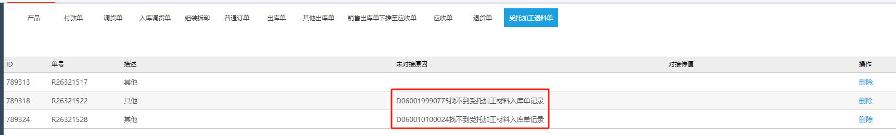
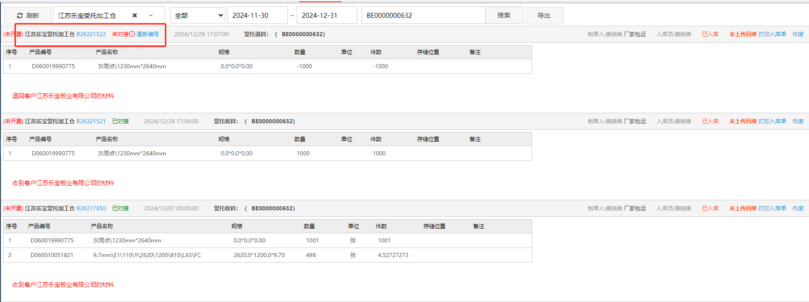
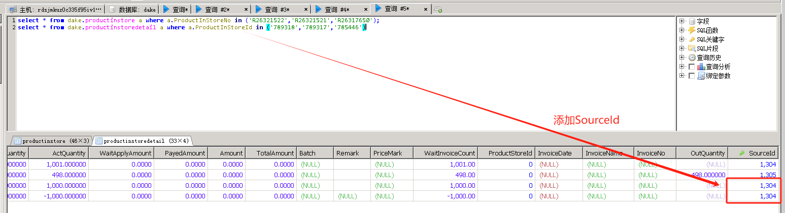
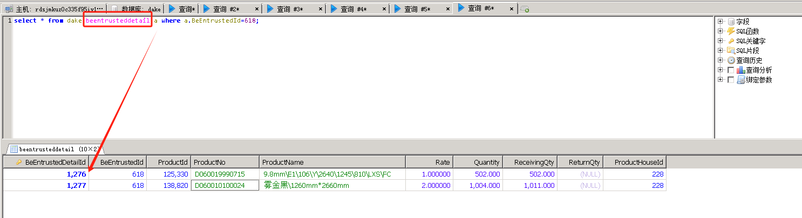
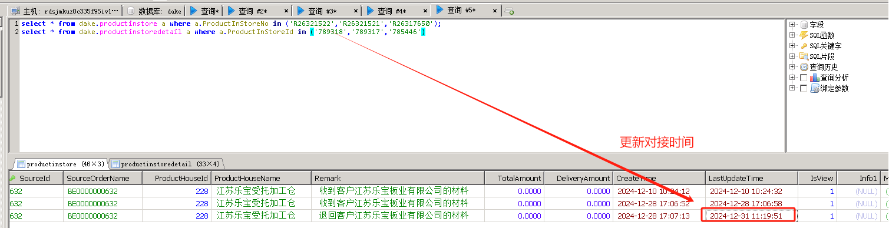
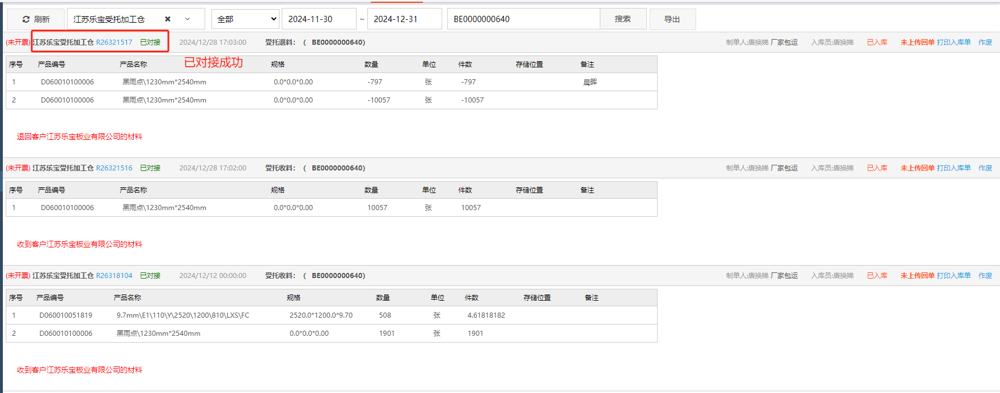

</img><h1>受托加工问题</h1>

::: info 提出问题:

<u>&nbsp;&nbsp;&nbsp;&nbsp;&nbsp;&nbsp;未对接原因:D060010100024 找不到受托加工材料入库单记录？</u>
:::

## 解决方法

::: tip 操作步骤 1:
&nbsp;&nbsp;&nbsp;&nbsp;&nbsp;&nbsp;根据未对接查询提供的信息，在对应公司组织下的入库单查询功能模块，输入入库单号 R26321517,可以得到受托加工生产领料单的单据编号 BE0000000640，通过查询编号 BE0000000640，清楚的知道了对应单据的领料数据和退料数据。
:::

> &nbsp;&nbsp;&nbsp;&nbsp;&nbsp;&nbsp;如图所展示的受托加工领料单编号可能与演示文档截图有出入，请注意根据实际单据情况查询相关数据。

---

::: tip 操作步骤 2:
&nbsp;&nbsp;&nbsp;&nbsp;&nbsp;&nbsp;通过步骤 1 展示的数据可以得知，受托加工单的领料数据和退料数据都是正常的，产品的实际入库数量并没有大于退库数量，产品的库存也没有负数，综上所述，大概是两个订单之间的关联关系出现了问题，导致其中的退料单据找不到入库单据了，登入服务器，打开数据库，查询入库表和明细表，如下图所示是对应的解决思路：
:::

---

::: tip 操作步骤 3:
&nbsp;&nbsp;&nbsp;&nbsp;&nbsp;&nbsp;最重要的 SourceId 来源于受托加工主表 beentrusteddetail，根据退料的产品编号去查询 SourceId == beentrusteddetailId，比如：D060010100024，如下图所示：
:::

::: tip 操作步骤 4:
&nbsp;&nbsp;&nbsp;&nbsp;&nbsp;&nbsp;入库单的明细表完成修改后，根据未对接的入库单编号，查询 productinstore 主表，找到对应的 LastUpdateTime 字段，更新对接时间即可。
:::

---

::: tip 操作步骤 5:
&nbsp;&nbsp;&nbsp;&nbsp;&nbsp;&nbsp;完成上述操作后，稍等几分钟看看是否对接成功，对接成功与否如图所示：
:::

---
