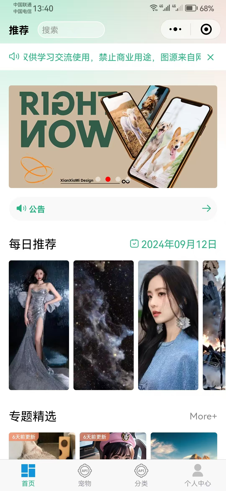
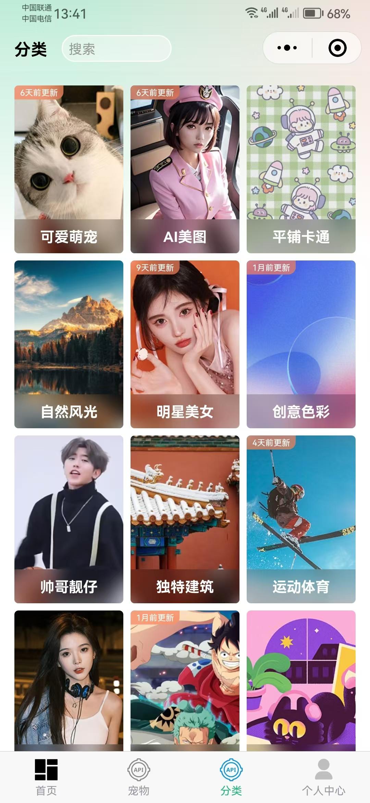
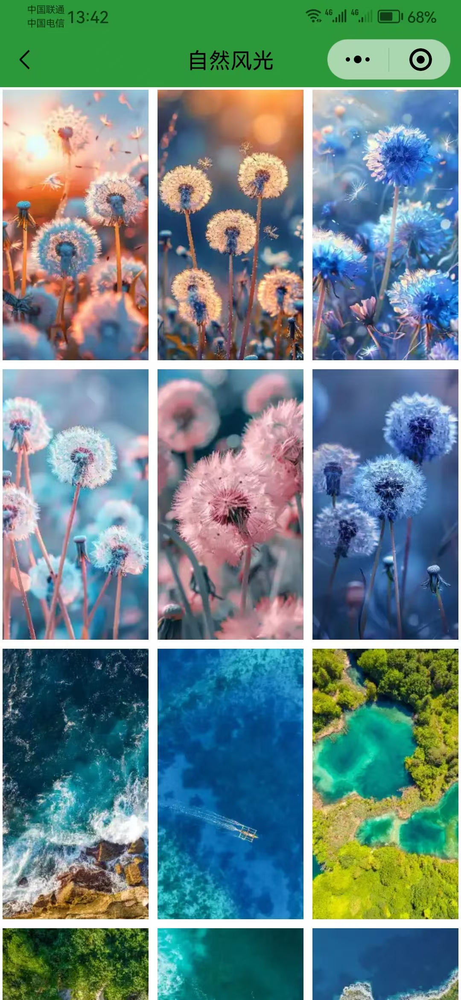
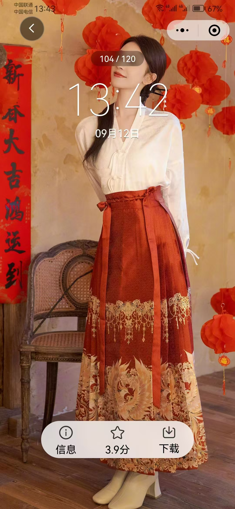
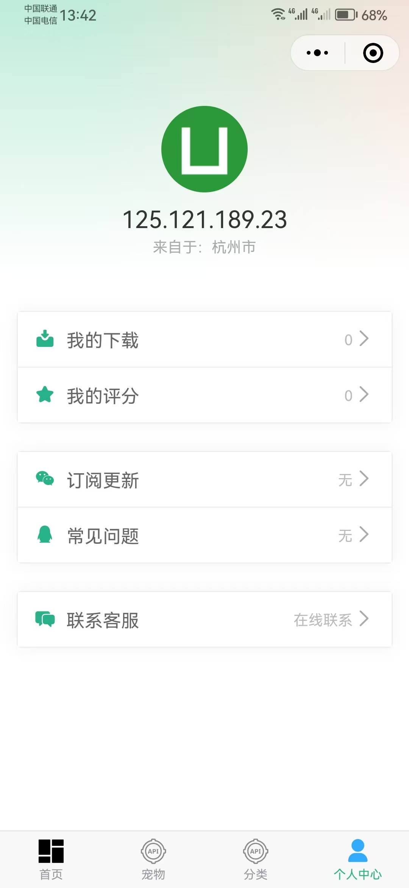

# 小熊猫壁纸-项目介绍

::: tip 使用说明
“小熊猫壁纸”项目是我使用uniapp开发的前端页面，使用unicloud的URL化开发的接口，目前小熊猫壁纸已经上线到了微信小程序，大家可以扫码下方二维码进行体验。
:::

  

注意：项目中的壁纸全部来自于网络，如果大家使用我的api接口，请作为个人使用学习交流使用，请勿用作商业用途，如果商用涉及到侵权侵权者自行承担。

---

---

# 项目部分截图

## 小熊猫壁纸-首页
 

## 小熊猫壁纸-分类
 

## 小熊猫壁纸-列表
 

## 小熊猫壁纸-预览详情
 

## 小熊猫壁纸-个人中心
 
