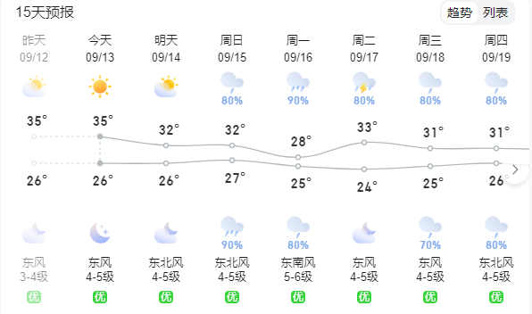

# **_实时天气查询接口_**

---

在开发网站或者 APP 的时候，如果界面比较单调单一，可以选择使用天气接口，给网站或者 APP 增加一些活力，如下图所示：


---

## **_接口描述_**

> 该接口可以传入城市名称查询天气，也可以不传入参数，当不传入参数的时候就是当前用户所在地的天气。
> 注意：只能查国内。

## **_接口地址_**

```js
https://tea.qingnian8.com/tools/weather
```

---

## **_请求方式_**

```ts
GET;
```

---

## **_请求参数_**

| 序号 | 参数名 | 参数值 | 是否必填 | 参数类型 |       描述说明       |
| :--: | :----: | :----: | :------: | :------: | :------------------: |
|  1   |  city  |  杭州  |    否    |  String  | 输入要查询的城市名称 |

---

## **_秘钥验证_**

| 序号 |   参数名   |   参数值   | 是否必填 | 参数类型 |    描述说明    |
| :--: | :--------: | :--------: | :------: | :------: | :------------: |
|  1   | access-key | dake123321 |    是    |  String  | 获得秘钥参数。 |

---

## **_微信小程序扫码查看_**


---

## **_响应示例_**

```ts
{
	"errCode": 0,
	"errMsg": "查询成功",
	"data": {
		"province": "浙江",
		"city": "杭州市",
		"adcode": "371400",
		"weather": "多云",
		"temperature": "24",
		"winddirection": "北",
		"windpower": "≤3",
		"humidity": "30",
		"reporttime": "2023-10-04 16:03:43"
	},
	"timeCost": 2
}
```

| 序号 |  参数名  | 参数类型 |     描述说明      |
| :--: | :------: | :------: | :---------------: |
|  1   | errCode  | Integer  | 0：成功 400：失败 |
|  2   |  errMsg  |  String  |   查询结果描述    |
|  3   | timeCost | Integer  |   接口消耗时间    |
|  4   |   data   |  String  | 实时天气详细参数  |

## **_详细天气对象返回参数_**

| 序号 |    参数名     |      描述说明      |
| :--: | :-----------: | :----------------: |
|  1   |   province    |        省份        |
|  2   |     city      |      城市名称      |
|  3   |    adcode     |      城市编码      |
|  4   |    weather    |        天气        |
|  5   |  temperature  |        温度        |
|  6   | winddirection |      风向描述      |
|  7   |   windpower   | 风力级别，单位：级 |
|  8   |   humidity    |      空气湿度      |
|  9   |  reporttime   |   数据发布的时间   |
